```python
import pandas as pd
import numpy as np
from sklearn.model_selection import train_test_split
from sklearn.ensemble import RandomForestClassifier
from sklearn.metrics import (
    accuracy_score, classification_report, confusion_matrix, f1_score
)
from sklearn.preprocessing import LabelEncoder
from sklearn.linear_model import LogisticRegression
from lightgbm import LGBMClassifier
!pip install catboost
from catboost import CatBoostClassifier
from xgboost import XGBClassifier

RANDOM_STATE = 42
TARGET = "collision_severity"

# 1.Load data
df = pd.read_csv("/content/UK_accidents_balanced.csv")
print(f"Loaded data: {df.shape[0]:,} rows x {df.shape[1]} columns")

# Shuffle toàn bộ dataset
df = df.sample(frac=1, random_state=RANDOM_STATE).reset_index(drop=True)

# 2. Drop columns that either identify the record or leak the target
leak_cols = [
    "enhanced_severity_collision",
    "collision_injury_based",
    "collision_adjusted_severity_serious",
    "collision_adjusted_severity_slight",
]
id_cols = [
    "collision_index", "collision_ref_no", "date", "time",
    "local_authority_ons_district", "local_authority_highway",
    "local_authority_highway_current", "lsoa_of_accident_location",
]

drop_cols = leak_cols + id_cols
df_model = df.drop(columns=[c for c in drop_cols if c in df.columns])

# 3. Handle missing values

num_cols = df_model.select_dtypes(include=[np.number]).columns.tolist()
num_cols.remove(TARGET)
cat_cols = df_model.select_dtypes(exclude=[np.number]).columns.tolist()

for c in num_cols:
    df_model[c] = df_model[c].fillna(df_model[c].median())
for c in cat_cols:
    df_model[c] = df_model[c].fillna("missing")

# 4. Encode remaining categorical columns

for c in cat_cols:
    df_model[c] = LabelEncoder().fit_transform(df_model[c].astype(str))


# 4b. Gộp nhãn: 2,3 -> 0 (chỉ giữ 1 = Fatal, còn lại = 0)

df_model[TARGET] = df_model[TARGET].replace({2: 0, 3: 0})
print("Phân bố nhãn sau khi gộp:")
print(df_model[TARGET].value_counts())


# 5. Train / test split

X = df_model.drop(columns=[TARGET])
y = df_model[TARGET]

X_train, X_test, y_train, y_test = train_test_split(
    X, y, test_size=0.2, random_state=RANDOM_STATE, stratify=y
)
print(f"Train: {X_train.shape[0]:,} rows | Test: {X_test.shape[0]:,} rows")


# 6. Train Models

# Logistic Regression
model1 = LogisticRegression(
    max_iter=5000,
    class_weight="balanced",
    random_state=42
)
model1.fit(X_train, y_train)

# Random Forest
model2 = RandomForestClassifier(
    n_estimators=300,
    max_depth=20,
    min_samples_leaf=5,
    class_weight="balanced",
    random_state=42,
    n_jobs=-1
)
model2.fit(X_train, y_train)

# XGBoost
model3 = XGBClassifier(
    n_estimators=500,
    learning_rate=0.05,
    max_depth=8,
    subsample=0.8,
    colsample_bytree=0.8,
    objective="binary:logistic",
    eval_metric="logloss",
    random_state=42
)
model3.fit(X_train, y_train)

# LightGBM
model4 = LGBMClassifier(
    n_estimators=500,
    learning_rate=0.05,
    max_depth=10,
    class_weight="balanced",
    random_state=42
)
model4.fit(X_train, y_train)

# CatBoost
model5 = CatBoostClassifier(
    iterations=500,
    depth=8,
    learning_rate=0.05,
    loss_function="Logloss",
    eval_metric="F1",
    verbose=False,
    random_seed=42
)
model5.fit(X_train, y_train)


# 7. Evaluate

models = {
    "Logistic Regression": model1,
    "Random Forest": model2,
    "XGBoost": model3,
    "LightGBM": model4,
    "CatBoost": model5
}

for name, model in models.items():

    print("\n" + "=" * 60)
    print(f"{name} RESULTS")
    print("=" * 60)

    y_pred = model.predict(X_test)

    acc = accuracy_score(y_test, y_pred)
    f1_macro = f1_score(y_test, y_pred, average="macro")

    print(f"Accuracy   : {acc:.4f}")
    print(f"F1 Macro   : {f1_macro:.4f}")

    print("\nClassification Report:")
    print(classification_report(
        y_test,
        y_pred,
        target_names=["Non-Fatal (0)", "Fatal (1)"]
    ))

    print("Confusion Matrix:")
    cm = confusion_matrix(y_test, y_pred, labels=[0, 1])
    print(cm)

    # Feature Importance
    if hasattr(model, "feature_importances_"):

      print("\nTop 15 Feature Importances:")

      importance = pd.Series(
        model.feature_importances_,
        index=X.columns
      ).sort_values(ascending=False)

      print(importance.head(15))
results = []

for name, model in models.items():

    y_pred = model.predict(X_test)

    results.append({
        "Model": name,
        "Accuracy": accuracy_score(y_test, y_pred),
        "F1 Macro": f1_score(y_test, y_pred, average="macro")
    })

results = pd.DataFrame(results)

print("\nModel Comparison")
print(results.sort_values("F1 Macro", ascending=False))
```

    Collecting catboost
      Downloading catboost-1.2.10-cp312-cp312-manylinux2014_x86_64.whl.metadata (1.2 kB)
    Requirement already satisfied: graphviz in /usr/local/lib/python3.12/dist-packages (from catboost) (0.21)
    Requirement already satisfied: matplotlib in /usr/local/lib/python3.12/dist-packages (from catboost) (3.10.0)
    Requirement already satisfied: numpy<3.0,>=1.16.0 in /usr/local/lib/python3.12/dist-packages (from catboost) (2.0.2)
    Requirement already satisfied: pandas<4.0,>=0.24 in /usr/local/lib/python3.12/dist-packages (from catboost) (2.2.2)
    Requirement already satisfied: scipy in /usr/local/lib/python3.12/dist-packages (from catboost) (1.16.3)
    Requirement already satisfied: plotly in /usr/local/lib/python3.12/dist-packages (from catboost) (5.24.1)
    Requirement already satisfied: six in /usr/local/lib/python3.12/dist-packages (from catboost) (1.17.0)
    Requirement already satisfied: python-dateutil>=2.8.2 in /usr/local/lib/python3.12/dist-packages (from pandas<4.0,>=0.24->catboost) (2.9.0.post0)
    Requirement already satisfied: pytz>=2020.1 in /usr/local/lib/python3.12/dist-packages (from pandas<4.0,>=0.24->catboost) (2025.2)
    Requirement already satisfied: tzdata>=2022.7 in /usr/local/lib/python3.12/dist-packages (from pandas<4.0,>=0.24->catboost) (2026.2)
    Requirement already satisfied: contourpy>=1.0.1 in /usr/local/lib/python3.12/dist-packages (from matplotlib->catboost) (1.3.3)
    Requirement already satisfied: cycler>=0.10 in /usr/local/lib/python3.12/dist-packages (from matplotlib->catboost) (0.12.1)
    Requirement already satisfied: fonttools>=4.22.0 in /usr/local/lib/python3.12/dist-packages (from matplotlib->catboost) (4.63.0)
    Requirement already satisfied: kiwisolver>=1.3.1 in /usr/local/lib/python3.12/dist-packages (from matplotlib->catboost) (1.5.0)
    Requirement already satisfied: packaging>=20.0 in /usr/local/lib/python3.12/dist-packages (from matplotlib->catboost) (26.2)
    Requirement already satisfied: pillow>=8 in /usr/local/lib/python3.12/dist-packages (from matplotlib->catboost) (11.3.0)
    Requirement already satisfied: pyparsing>=2.3.1 in /usr/local/lib/python3.12/dist-packages (from matplotlib->catboost) (3.3.2)
    Requirement already satisfied: tenacity>=6.2.0 in /usr/local/lib/python3.12/dist-packages (from plotly->catboost) (9.1.4)
    Downloading catboost-1.2.10-cp312-cp312-manylinux2014_x86_64.whl (97.1 MB)
       ━━━━━━━━━━━━━━━━━━━━━━━━━━━━━━━━━━━━━━━━ 97.1/97.1 MB 9.3 MB/s eta 0:00:00
    [?25hInstalling collected packages: catboost
    Successfully installed catboost-1.2.10
    Loaded data: 289,444 rows x 44 columns
    Phân bố nhãn sau khi gộp:
    collision_severity
    1    144722
    0    144722
    Name: count, dtype: int64
    Train: 231,555 rows | Test: 57,889 rows


    /usr/local/lib/python3.12/dist-packages/sklearn/linear_model/_logistic.py:465: ConvergenceWarning: lbfgs failed to converge (status=1):
    STOP: TOTAL NO. OF ITERATIONS REACHED LIMIT.
    
    Increase the number of iterations (max_iter) or scale the data as shown in:
        https://scikit-learn.org/stable/modules/preprocessing.html
    Please also refer to the documentation for alternative solver options:
        https://scikit-learn.org/stable/modules/linear_model.html#logistic-regression
      n_iter_i = _check_optimize_result(


    [LightGBM] [Info] Number of positive: 115778, number of negative: 115777
    [LightGBM] [Info] Auto-choosing row-wise multi-threading, the overhead of testing was 0.034704 seconds.
    You can set `force_row_wise=true` to remove the overhead.
    And if memory is not enough, you can set `force_col_wise=true`.
    [LightGBM] [Info] Total Bins 2111
    [LightGBM] [Info] Number of data points in the train set: 231555, number of used features: 31
    [LightGBM] [Info] [binary:BoostFromScore]: pavg=0.500000 -> initscore=0.000000
    [LightGBM] [Info] Start training from score 0.000000
    
    ============================================================
    Logistic Regression RESULTS
    ============================================================
    Accuracy   : 0.6752
    F1 Macro   : 0.6750
    
    Classification Report:
                   precision    recall  f1-score   support
    
    Non-Fatal (0)       0.67      0.70      0.68     28945
        Fatal (1)       0.68      0.65      0.67     28944
    
         accuracy                           0.68     57889
        macro avg       0.68      0.68      0.68     57889
     weighted avg       0.68      0.68      0.68     57889
    
    Confusion Matrix:
    [[20195  8750]
     [10054 18890]]
    
    ============================================================
    Random Forest RESULTS
    ============================================================
    Accuracy   : 0.7300
    F1 Macro   : 0.7299
    
    Classification Report:
                   precision    recall  f1-score   support
    
    Non-Fatal (0)       0.74      0.71      0.73     28945
        Fatal (1)       0.72      0.75      0.73     28944
    
         accuracy                           0.73     57889
        macro avg       0.73      0.73      0.73     57889
     weighted avg       0.73      0.73      0.73     57889
    
    Confusion Matrix:
    [[20607  8338]
     [ 7293 21651]]
    
    Top 15 Feature Importances:
    number_of_casualties                           0.108301
    speed_limit                                    0.098124
    number_of_vehicles                             0.089796
    collision_year                                 0.062894
    location_easting_osgr                          0.053804
    location_northing_osgr                         0.052960
    first_road_number                              0.045857
    local_authority_district                       0.044216
    did_police_officer_attend_scene_of_accident    0.043746
    light_conditions                               0.040317
    junction_detail_historic                       0.033908
    urban_or_rural_area                            0.033599
    police_force                                   0.029791
    junction_control                               0.028901
    latitude                                       0.028673
    dtype: float64
    
    ============================================================
    XGBoost RESULTS
    ============================================================
    Accuracy   : 0.7358
    F1 Macro   : 0.7357
    
    Classification Report:
                   precision    recall  f1-score   support
    
    Non-Fatal (0)       0.74      0.72      0.73     28945
        Fatal (1)       0.73      0.75      0.74     28944
    
         accuracy                           0.74     57889
        macro avg       0.74      0.74      0.74     57889
     weighted avg       0.74      0.74      0.74     57889
    
    Confusion Matrix:
    [[20780  8165]
     [ 7129 21815]]
    
    Top 15 Feature Importances:
    did_police_officer_attend_scene_of_accident    0.151740
    speed_limit                                    0.146597
    number_of_casualties                           0.125735
    number_of_vehicles                             0.097976
    urban_or_rural_area                            0.055046
    junction_control                               0.040491
    light_conditions                               0.035311
    trunk_road_flag                                0.031985
    junction_detail_historic                       0.027135
    road_type                                      0.022869
    first_road_class                               0.020359
    collision_year                                 0.019425
    road_surface_conditions                        0.018442
    carriageway_hazards                            0.016669
    pedestrian_crossing                            0.013728
    dtype: float32
    
    ============================================================
    LightGBM RESULTS
    ============================================================
    Accuracy   : 0.7351
    F1 Macro   : 0.7350
    
    Classification Report:
                   precision    recall  f1-score   support
    
    Non-Fatal (0)       0.74      0.72      0.73     28945
        Fatal (1)       0.73      0.75      0.74     28944
    
         accuracy                           0.74     57889
        macro avg       0.74      0.74      0.73     57889
     weighted avg       0.74      0.74      0.73     57889
    
    Confusion Matrix:
    [[20712  8233]
     [ 7104 21840]]
    
    Top 15 Feature Importances:
    collision_year                                 1497
    location_easting_osgr                          1338
    location_northing_osgr                         1233
    local_authority_district                        863
    first_road_number                               847
    number_of_vehicles                              720
    latitude                                        692
    longitude                                       654
    number_of_casualties                            643
    police_force                                    545
    speed_limit                                     514
    day_of_week                                     500
    light_conditions                                461
    did_police_officer_attend_scene_of_accident     456
    road_type                                       418
    dtype: int32
    
    ============================================================
    CatBoost RESULTS
    ============================================================
    Accuracy   : 0.7360
    F1 Macro   : 0.7359
    
    Classification Report:
                   precision    recall  f1-score   support
    
    Non-Fatal (0)       0.75      0.72      0.73     28945
        Fatal (1)       0.73      0.76      0.74     28944
    
         accuracy                           0.74     57889
        macro avg       0.74      0.74      0.74     57889
     weighted avg       0.74      0.74      0.74     57889
    
    Confusion Matrix:
    [[20739  8206]
     [ 7078 21866]]
    
    Top 15 Feature Importances:
    number_of_vehicles                             14.591974
    number_of_casualties                           12.072674
    speed_limit                                    10.801238
    did_police_officer_attend_scene_of_accident    10.787933
    collision_year                                  6.118753
    light_conditions                                4.502115
    urban_or_rural_area                             3.997991
    road_type                                       3.091707
    junction_detail_historic                        2.997804
    junction_control                                2.938990
    first_road_class                                2.878748
    police_force                                    2.680179
    location_northing_osgr                          2.639487
    location_easting_osgr                           2.378923
    road_surface_conditions                         2.252414
    dtype: float64
    
    Model Comparison
                     Model  Accuracy  F1 Macro
    4             CatBoost  0.735977  0.735877
    2              XGBoost  0.735805  0.735720
    3             LightGBM  0.735062  0.734961
    1        Random Forest  0.729983  0.729895
    0  Logistic Regression  0.675171  0.675006


# 🧪 Machine Learning Experiments

This section extends the baseline pipeline above with a full experimental study:

1. **Part 1 — Baseline & Advanced Models**: 9 classifiers commonly used in accident-severity literature, evaluated under one unified protocol.
2. **Part 2 — Improved CatBoost with Spatial Feature Engineering**: a spatially-aware CatBoost model built from `latitude` / `longitude`.
3. **Part 3 — Ablation Study**: isolates the contribution of spatial features vs. CatBoost-specific training improvements.
4. **Part 4 — Visualization**: feature importance, SHAP, ROC/PR curves, confusion matrix, and a spatial cluster map.
5. **Part 5 — Discussion**: a paper-style write-up of the findings.

All experiments reuse `X_train`, `X_test`, `y_train`, `y_test`, `df`, `cat_cols` and `RANDOM_STATE` produced by the preprocessing pipeline above, so results stay directly comparable and no existing code is modified.


## Part 0 — Exploratory Data Analysis

Before modeling, we characterize the dataset: how much data is missing, how the target is distributed, how key variables relate to fatality risk, and how accidents are distributed geographically. This uses the raw `df` (before the pipeline's imputation/encoding above), so categories and missing values are shown in their original, human-readable form.


```python
import matplotlib.pyplot as plt
# --- Missing value rates (computed on the untouched `df`, before the pipeline's fillna) ---
missing_rates = (df[df_model.columns].isna().mean() * 100).sort_values(ascending=False)
missing_rates = missing_rates[missing_rates > 0]

fig, ax = plt.subplots(figsize=(8, max(4, len(missing_rates) * 0.3)))
missing_rates.sort_values().plot.barh(ax=ax, color="indianred")
ax.set_xlabel("Missing (%)")
ax.set_title("Missing Value Rate by Column (before imputation)")
plt.tight_layout()
plt.show()

print(missing_rates)

```


    
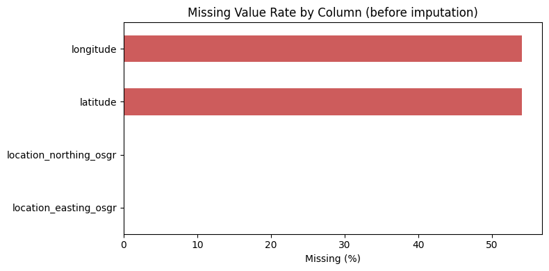
    


    longitude                 54.096820
    latitude                  54.096820
    location_northing_osgr     0.134396
    location_easting_osgr      0.134396
    dtype: float64


```python
# --- Target distribution: original 3-class severity vs. the binary Fatal/Non-Fatal modeling target ---
severity_labels = {1: "Fatal", 2: "Serious", 3: "Slight"}

fig, axes = plt.subplots(1, 2, figsize=(12, 4))

df[TARGET].map(severity_labels).value_counts().plot.bar(ax=axes[0], color="steelblue")
axes[0].set_title("Original collision_severity (3 classes)")
axes[0].set_ylabel("Count")
axes[0].tick_params(axis="x", rotation=0)

y.map({0: "Non-Fatal", 1: "Fatal"}).value_counts().plot.bar(ax=axes[1], color=["#4C72B0", "#C44E52"])
axes[1].set_title("Modeling Target: Fatal vs Non-Fatal")
axes[1].set_ylabel("Count")
axes[1].tick_params(axis="x", rotation=0)

plt.tight_layout()
plt.show()

print("Modeling target proportions:")
print(y.value_counts(normalize=True).rename("proportion"))

```


    
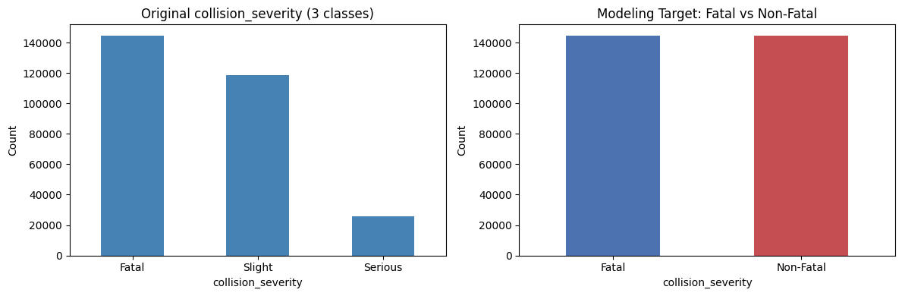
    


    Modeling target proportions:
    collision_severity
    1    0.5
    0    0.5
    Name: proportion, dtype: float64


```python
# --- Fatal rate by key variables (original, human-readable categories from `df`) ---
key_vars = ["speed_limit", "weather_conditions", "road_type", "light_conditions", "urban_or_rural_area"]
overall_fatal_rate = (df[TARGET] == 1).mean()

fig, axes = plt.subplots(len(key_vars), 1, figsize=(8, 4 * len(key_vars)))
for ax, col in zip(axes, key_vars):
    rate = df.groupby(col)[TARGET].apply(lambda s: (s == 1).mean()).sort_values(ascending=False)
    rate.plot.bar(ax=ax, color="darkorange")
    ax.set_title(f"Fatal Rate by {col}")
    ax.set_ylabel("Fatal rate")
    ax.axhline(overall_fatal_rate, color="black", linestyle="--", linewidth=1, label="Overall fatal rate")
    ax.legend()

plt.tight_layout()
plt.show()

```


    
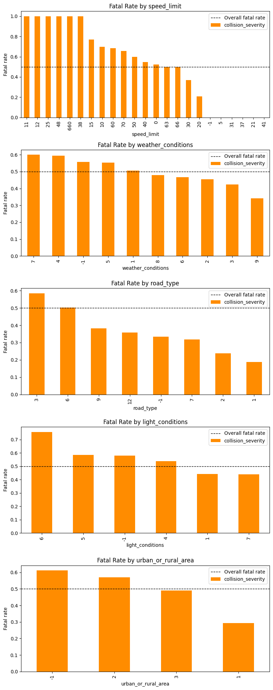
    


```python
# --- Geographic distribution of accidents by severity (raw lat/lon, before imputation) ---
geo = df[["latitude", "longitude", TARGET]].dropna()

fig, ax = plt.subplots(figsize=(7, 9))
for sev, color, label in [(1, "red", "Fatal"), (2, "orange", "Serious"), (3, "steelblue", "Slight")]:
    subset = geo[geo[TARGET] == sev]
    ax.scatter(subset["longitude"], subset["latitude"], s=2, alpha=0.15, color=color, label=label)

ax.set_title(f"Geographic Distribution of Accidents by Severity (n={len(geo):,} with known coordinates)")
ax.set_xlabel("Longitude")
ax.set_ylabel("Latitude")
ax.set_aspect("equal")
ax.legend(markerscale=8)
plt.tight_layout()
plt.show()

```


    
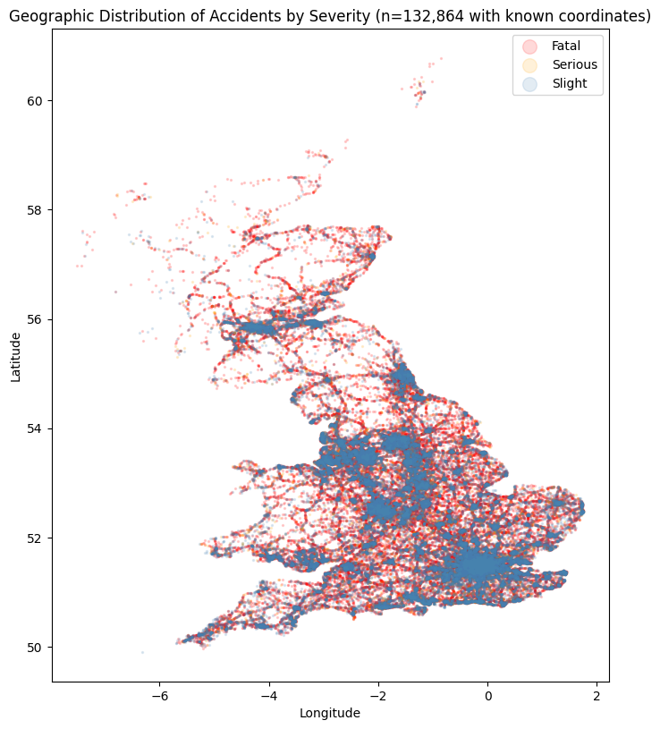
    


## Part 1 — Baseline & Advanced Machine Learning Models

Traffic-accident severity/fatality studies in the literature most commonly benchmark tree-ensemble and boosting methods against linear baselines. We evaluate **9 models**:

| Family | Model(s) |
|---|---|
| Linear | Logistic Regression |
| Single tree | Decision Tree |
| Bagging ensembles | Random Forest, Extra Trees |
| Classic boosting | AdaBoost, Gradient Boosting |
| Modern GBDT | XGBoost, LightGBM, CatBoost |

Every model is trained on the same `X_train`/`y_train` and evaluated on the same `X_test`/`y_test` produced by the preprocessing pipeline above, so the comparison is fair. A single reusable `train_and_evaluate()` function guarantees every model is measured with the same metrics: **Accuracy, Precision, Recall, F1-Score, ROC-AUC, Confusion Matrix, Training Time, Inference Time**.


```python
# --- Additional imports for the extended ML section (Parts 1-5) ---
import time
import matplotlib.pyplot as plt
import seaborn as sns

from sklearn.tree import DecisionTreeClassifier
from sklearn.ensemble import (
    ExtraTreesClassifier, AdaBoostClassifier, GradientBoostingClassifier
)
from sklearn.cluster import KMeans
from sklearn.metrics import (
    precision_score, recall_score, roc_auc_score, roc_curve, precision_recall_curve
)

sns.set_style("whitegrid")


def train_and_evaluate(name, model, X_tr, y_tr, X_te, y_te,
                        fit_kwargs=None, already_fitted=False, train_time=None):
    """
    Reusable train/evaluate routine shared by Part 1, Part 3 (ablation) and Part 4.

    If already_fitted=True, `model` is assumed pre-trained (used for the Improved
    CatBoost model, whose training involves early stopping / a validation set and
    therefore happens outside this helper) and `train_time` must be supplied.
    """
    fit_kwargs = fit_kwargs or {}

    if not already_fitted:
        start = time.time()
        model.fit(X_tr, y_tr, **fit_kwargs)
        train_time = time.time() - start

    start = time.time()
    y_pred = model.predict(X_te)
    inference_time = time.time() - start

    y_proba = (
        model.predict_proba(X_te)[:, 1] if hasattr(model, "predict_proba") else y_pred
    )

    cm = confusion_matrix(y_te, y_pred, labels=[0, 1])

    metrics = {
        "Model": name,
        "Accuracy": accuracy_score(y_te, y_pred),
        "Precision": precision_score(y_te, y_pred, zero_division=0),
        "Recall": recall_score(y_te, y_pred, zero_division=0),
        "F1-Score": f1_score(y_te, y_pred),
        "ROC-AUC": roc_auc_score(y_te, y_proba),
        "Training Time (s)": train_time,
        "Inference Time (s)": inference_time,
    }
    return metrics, model, y_pred, y_proba, cm


def print_model_report(name, metrics, cm):
    """Console report shared across all sections."""
    print("\n" + "=" * 60)
    print(f"{name} RESULTS")
    print("=" * 60)
    for k in ["Accuracy", "Precision", "Recall", "F1-Score", "ROC-AUC"]:
        print(f"{k:<12}: {metrics[k]:.4f}")
    print(f"{'Train Time':<12}: {metrics['Training Time (s)']:.2f}s")
    print(f"{'Infer Time':<12}: {metrics['Inference Time (s)']:.4f}s")
    print("Confusion Matrix ([[TN, FP], [FN, TP]]):")
    print(cm)

```


```python
# --- Model registry: consistent RANDOM_STATE, reused train/test split ---
baseline_model_registry = {
    "Logistic Regression": LogisticRegression(
        max_iter=5000, class_weight="balanced", random_state=RANDOM_STATE
    ),
    "Decision Tree": DecisionTreeClassifier(
        max_depth=12, min_samples_leaf=5, class_weight="balanced", random_state=RANDOM_STATE
    ),
    "Random Forest": RandomForestClassifier(
        n_estimators=300, max_depth=20, min_samples_leaf=5,
        class_weight="balanced", random_state=RANDOM_STATE, n_jobs=-1
    ),
    "Extra Trees": ExtraTreesClassifier(
        n_estimators=300, max_depth=20, min_samples_leaf=5,
        class_weight="balanced", random_state=RANDOM_STATE, n_jobs=-1
    ),
    "AdaBoost": AdaBoostClassifier(
        n_estimators=200, learning_rate=0.5, random_state=RANDOM_STATE
    ),
    "Gradient Boosting": GradientBoostingClassifier(
        n_estimators=200, max_depth=4, learning_rate=0.05,
        subsample=0.8, random_state=RANDOM_STATE
    ),
    "XGBoost": XGBClassifier(
        n_estimators=500, learning_rate=0.05, max_depth=8,
        subsample=0.8, colsample_bytree=0.8, objective="binary:logistic",
        eval_metric="logloss", random_state=RANDOM_STATE, n_jobs=-1
    ),
    "LightGBM": LGBMClassifier(
        n_estimators=500, learning_rate=0.05, max_depth=10,
        class_weight="balanced", random_state=RANDOM_STATE
    ),
    "CatBoost (Baseline)": CatBoostClassifier(
        iterations=500, depth=8, learning_rate=0.05,
        loss_function="Logloss", eval_metric="F1",
        verbose=False, random_seed=RANDOM_STATE
    ),
}

baseline_results = []
baseline_fitted_models = {}
baseline_confusion_matrices = {}

for name, model in baseline_model_registry.items():
    metrics, fitted_model, y_pred, y_proba, cm = train_and_evaluate(
        name, model, X_train, y_train, X_test, y_test
    )
    print_model_report(name, metrics, cm)

    baseline_results.append(metrics)
    baseline_fitted_models[name] = fitted_model
    baseline_confusion_matrices[name] = cm

baseline_comparison_df = pd.DataFrame(baseline_results).sort_values(
    "ROC-AUC", ascending=False
).reset_index(drop=True)

```

    /usr/local/lib/python3.12/dist-packages/sklearn/linear_model/_logistic.py:465: ConvergenceWarning: lbfgs failed to converge (status=1):
    STOP: TOTAL NO. OF ITERATIONS REACHED LIMIT.
    
    Increase the number of iterations (max_iter) or scale the data as shown in:
        https://scikit-learn.org/stable/modules/preprocessing.html
    Please also refer to the documentation for alternative solver options:
        https://scikit-learn.org/stable/modules/linear_model.html#logistic-regression
      n_iter_i = _check_optimize_result(


    
    ============================================================
    Logistic Regression RESULTS
    ============================================================
    Accuracy    : 0.6752
    Precision   : 0.6834
    Recall      : 0.6526
    F1-Score    : 0.6677
    ROC-AUC     : 0.7368
    Train Time  : 302.01s
    Infer Time  : 0.0354s
    Confusion Matrix ([[TN, FP], [FN, TP]]):
    [[20195  8750]
     [10054 18890]]
    
    ============================================================
    Decision Tree RESULTS
    ============================================================
    Accuracy    : 0.7156
    Precision   : 0.7045
    Recall      : 0.7425
    F1-Score    : 0.7230
    ROC-AUC     : 0.7839
    Train Time  : 3.23s
    Infer Time  : 0.0146s
    Confusion Matrix ([[TN, FP], [FN, TP]]):
    [[19932  9013]
     [ 7453 21491]]
    
    ============================================================
    Random Forest RESULTS
    ============================================================
    Accuracy    : 0.7300
    Precision   : 0.7220
    Recall      : 0.7480
    F1-Score    : 0.7348
    ROC-AUC     : 0.8066
    Train Time  : 121.81s
    Infer Time  : 2.5136s
    Confusion Matrix ([[TN, FP], [FN, TP]]):
    [[20607  8338]
     [ 7293 21651]]
    
    ============================================================
    Extra Trees RESULTS
    ============================================================
    Accuracy    : 0.7150
    Precision   : 0.7085
    Recall      : 0.7305
    F1-Score    : 0.7193
    ROC-AUC     : 0.7883
    Train Time  : 62.29s
    Infer Time  : 2.2143s
    Confusion Matrix ([[TN, FP], [FN, TP]]):
    [[20245  8700]
     [ 7801 21143]]
    
    ============================================================
    AdaBoost RESULTS
    ============================================================
    Accuracy    : 0.7115
    Precision   : 0.7135
    Recall      : 0.7067
    F1-Score    : 0.7101
    ROC-AUC     : 0.7873
    Train Time  : 55.98s
    Infer Time  : 0.6191s
    Confusion Matrix ([[TN, FP], [FN, TP]]):
    [[20731  8214]
     [ 8489 20455]]
    
    ============================================================
    Gradient Boosting RESULTS
    ============================================================
    Accuracy    : 0.7305
    Precision   : 0.7194
    Recall      : 0.7560
    F1-Score    : 0.7372
    ROC-AUC     : 0.8068
    Train Time  : 163.60s
    Infer Time  : 0.2413s
    Confusion Matrix ([[TN, FP], [FN, TP]]):
    [[20409  8536]
     [ 7063 21881]]
    
    ============================================================
    XGBoost RESULTS
    ============================================================
    Accuracy    : 0.7358
    Precision   : 0.7277
    Recall      : 0.7537
    F1-Score    : 0.7404
    ROC-AUC     : 0.8130
    Train Time  : 16.48s
    Infer Time  : 0.9451s
    Confusion Matrix ([[TN, FP], [FN, TP]]):
    [[20780  8165]
     [ 7129 21815]]
    [LightGBM] [Info] Number of positive: 115778, number of negative: 115777
    [LightGBM] [Info] Auto-choosing row-wise multi-threading, the overhead of testing was 0.036027 seconds.
    You can set `force_row_wise=true` to remove the overhead.
    And if memory is not enough, you can set `force_col_wise=true`.
    [LightGBM] [Info] Total Bins 2111
    [LightGBM] [Info] Number of data points in the train set: 231555, number of used features: 31
    [LightGBM] [Info] [binary:BoostFromScore]: pavg=0.500000 -> initscore=0.000000
    [LightGBM] [Info] Start training from score 0.000000
    
    ============================================================
    LightGBM RESULTS
    ============================================================
    Accuracy    : 0.7351
    Precision   : 0.7262
    Recall      : 0.7546
    F1-Score    : 0.7401
    ROC-AUC     : 0.8124
    Train Time  : 14.30s
    Infer Time  : 1.5267s
    Confusion Matrix ([[TN, FP], [FN, TP]]):
    [[20712  8233]
     [ 7104 21840]]
    
    ============================================================
    CatBoost (Baseline) RESULTS
    ============================================================
    Accuracy    : 0.7360
    Precision   : 0.7271
    Recall      : 0.7555
    F1-Score    : 0.7410
    ROC-AUC     : 0.8132
    Train Time  : 41.88s
    Infer Time  : 0.0641s
    Confusion Matrix ([[TN, FP], [FN, TP]]):
    [[20739  8206]
     [ 7078 21866]]


```python
print("\nFinal Model Comparison (Part 1 — Baseline & Advanced Models)")
display_cols = ["Model", "Accuracy", "Precision", "Recall", "F1-Score", "ROC-AUC",
                 "Training Time (s)", "Inference Time (s)"]
baseline_comparison_df_display = baseline_comparison_df[display_cols].round(4)
print(baseline_comparison_df_display.to_string(index=False))

fig, ax = plt.subplots(figsize=(9, 5))
sns.barplot(
    data=baseline_comparison_df, x="ROC-AUC", y="Model",
    hue="Model", palette="viridis", legend=False, ax=ax
)
ax.set_title("Part 1 — Model Comparison by ROC-AUC")
ax.set_xlim(0.5, 1.0)
plt.tight_layout()
plt.show()

baseline_comparison_df_display

```

    
    Final Model Comparison (Part 1 — Baseline & Advanced Models)
                  Model  Accuracy  Precision  Recall  F1-Score  ROC-AUC  Training Time (s)  Inference Time (s)
    CatBoost (Baseline)    0.7360     0.7271  0.7555    0.7410   0.8132            41.8774              0.0641
                XGBoost    0.7358     0.7277  0.7537    0.7404   0.8130            16.4809              0.9451
               LightGBM    0.7351     0.7262  0.7546    0.7401   0.8124            14.2957              1.5267
      Gradient Boosting    0.7305     0.7194  0.7560    0.7372   0.8068           163.5982              0.2413
          Random Forest    0.7300     0.7220  0.7480    0.7348   0.8066           121.8057              2.5136
            Extra Trees    0.7150     0.7085  0.7305    0.7193   0.7883            62.2942              2.2143
               AdaBoost    0.7115     0.7135  0.7067    0.7101   0.7873            55.9759              0.6191
          Decision Tree    0.7156     0.7045  0.7425    0.7230   0.7839             3.2269              0.0146
    Logistic Regression    0.6752     0.6834  0.6526    0.6677   0.7368           302.0089              0.0354


    
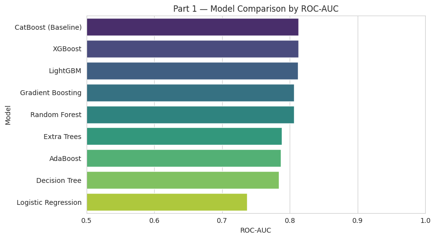
    


  <div id="df-1a9d3c76-79f2-4c4b-9860-fc6754359049" class="colab-df-container">
    <div>
<style scoped>
    .dataframe tbody tr th:only-of-type {
        vertical-align: middle;
    }

    .dataframe tbody tr th {
        vertical-align: top;
    }

    .dataframe thead th {
        text-align: right;
    }
</style>
<table border="1" class="dataframe">
  <thead>
    <tr style="text-align: right;">
      <th></th>
      <th>Model</th>
      <th>Accuracy</th>
      <th>Precision</th>
      <th>Recall</th>
      <th>F1-Score</th>
      <th>ROC-AUC</th>
      <th>Training Time (s)</th>
      <th>Inference Time (s)</th>
    </tr>
  </thead>
  <tbody>
    <tr>
      <th>0</th>
      <td>CatBoost (Baseline)</td>
      <td>0.7360</td>
      <td>0.7271</td>
      <td>0.7555</td>
      <td>0.7410</td>
      <td>0.8132</td>
      <td>41.8774</td>
      <td>0.0641</td>
    </tr>
    <tr>
      <th>1</th>
      <td>XGBoost</td>
      <td>0.7358</td>
      <td>0.7277</td>
      <td>0.7537</td>
      <td>0.7404</td>
      <td>0.8130</td>
      <td>16.4809</td>
      <td>0.9451</td>
    </tr>
    <tr>
      <th>2</th>
      <td>LightGBM</td>
      <td>0.7351</td>
      <td>0.7262</td>
      <td>0.7546</td>
      <td>0.7401</td>
      <td>0.8124</td>
      <td>14.2957</td>
      <td>1.5267</td>
    </tr>
    <tr>
      <th>3</th>
      <td>Gradient Boosting</td>
      <td>0.7305</td>
      <td>0.7194</td>
      <td>0.7560</td>
      <td>0.7372</td>
      <td>0.8068</td>
      <td>163.5982</td>
      <td>0.2413</td>
    </tr>
    <tr>
      <th>4</th>
      <td>Random Forest</td>
      <td>0.7300</td>
      <td>0.7220</td>
      <td>0.7480</td>
      <td>0.7348</td>
      <td>0.8066</td>
      <td>121.8057</td>
      <td>2.5136</td>
    </tr>
    <tr>
      <th>5</th>
      <td>Extra Trees</td>
      <td>0.7150</td>
      <td>0.7085</td>
      <td>0.7305</td>
      <td>0.7193</td>
      <td>0.7883</td>
      <td>62.2942</td>
      <td>2.2143</td>
    </tr>
    <tr>
      <th>6</th>
      <td>AdaBoost</td>
      <td>0.7115</td>
      <td>0.7135</td>
      <td>0.7067</td>
      <td>0.7101</td>
      <td>0.7873</td>
      <td>55.9759</td>
      <td>0.6191</td>
    </tr>
    <tr>
      <th>7</th>
      <td>Decision Tree</td>
      <td>0.7156</td>
      <td>0.7045</td>
      <td>0.7425</td>
      <td>0.7230</td>
      <td>0.7839</td>
      <td>3.2269</td>
      <td>0.0146</td>
    </tr>
    <tr>
      <th>8</th>
      <td>Logistic Regression</td>
      <td>0.6752</td>
      <td>0.6834</td>
      <td>0.6526</td>
      <td>0.6677</td>
      <td>0.7368</td>
      <td>302.0089</td>
      <td>0.0354</td>
    </tr>
  </tbody>
</table>
</div>
    <div class="colab-df-buttons">

  <div class="colab-df-container">
    <button class="colab-df-convert" onclick="convertToInteractive('df-1a9d3c76-79f2-4c4b-9860-fc6754359049')"
            title="Convert this dataframe to an interactive table."
            style="display:none;">

  <svg xmlns="http://www.w3.org/2000/svg" height="24px" viewBox="0 -960 960 960">
    <path d="M120-120v-720h720v720H120Zm60-500h600v-160H180v160Zm220 220h160v-160H400v160Zm0 220h160v-160H400v160ZM180-400h160v-160H180v160Zm440 0h160v-160H620v160ZM180-180h160v-160H180v160Zm440 0h160v-160H620v160Z"/>
  </svg>
    </button>

  <style>
    .colab-df-container {
      display:flex;
      gap: 12px;
    }

    .colab-df-convert {
      background-color: #E8F0FE;
      border: none;
      border-radius: 50%;
      cursor: pointer;
      display: none;
      fill: #1967D2;
      height: 32px;
      padding: 0 0 0 0;
      width: 32px;
    }

    .colab-df-convert:hover {
      background-color: #E2EBFA;
      box-shadow: 0px 1px 2px rgba(60, 64, 67, 0.3), 0px 1px 3px 1px rgba(60, 64, 67, 0.15);
      fill: #174EA6;
    }

    .colab-df-buttons div {
      margin-bottom: 4px;
    }

    [theme=dark] .colab-df-convert {
      background-color: #3B4455;
      fill: #D2E3FC;
    }

    [theme=dark] .colab-df-convert:hover {
      background-color: #434B5C;
      box-shadow: 0px 1px 3px 1px rgba(0, 0, 0, 0.15);
      filter: drop-shadow(0px 1px 2px rgba(0, 0, 0, 0.3));
      fill: #FFFFFF;
    }
  </style>

    <script>
      const buttonEl =
        document.querySelector('#df-1a9d3c76-79f2-4c4b-9860-fc6754359049 button.colab-df-convert');
      buttonEl.style.display =
        google.colab.kernel.accessAllowed ? 'block' : 'none';

      async function convertToInteractive(key) {
        const element = document.querySelector('#df-1a9d3c76-79f2-4c4b-9860-fc6754359049');
        const dataTable =
          await google.colab.kernel.invokeFunction('convertToInteractive',
                                                    [key], {});
        if (!dataTable) return;

        const docLinkHtml = 'Like what you see? Visit the ' +
          '<a target="_blank" href=https://colab.research.google.com/notebooks/data_table.ipynb>data table notebook</a>'
          + ' to learn more about interactive tables.';
        element.innerHTML = '';
        dataTable['output_type'] = 'display_data';
        await google.colab.output.renderOutput(dataTable, element);
        const docLink = document.createElement('div');
        docLink.innerHTML = docLinkHtml;
        element.appendChild(docLink);
      }
    </script>
  </div>


  <div id="id_b78d7408-50a8-42f9-88b0-dc84f4c9f57c">
    <style>
      .colab-df-generate {
        background-color: #E8F0FE;
        border: none;
        border-radius: 50%;
        cursor: pointer;
        display: none;
        fill: #1967D2;
        height: 32px;
        padding: 0 0 0 0;
        width: 32px;
      }

      .colab-df-generate:hover {
        background-color: #E2EBFA;
        box-shadow: 0px 1px 2px rgba(60, 64, 67, 0.3), 0px 1px 3px 1px rgba(60, 64, 67, 0.15);
        fill: #174EA6;
      }

      [theme=dark] .colab-df-generate {
        background-color: #3B4455;
        fill: #D2E3FC;
      }

      [theme=dark] .colab-df-generate:hover {
        background-color: #434B5C;
        box-shadow: 0px 1px 3px 1px rgba(0, 0, 0, 0.15);
        filter: drop-shadow(0px 1px 2px rgba(0, 0, 0, 0.3));
        fill: #FFFFFF;
      }
    </style>
    <button class="colab-df-generate" onclick="generateWithVariable('baseline_comparison_df_display')"
            title="Generate code using this dataframe."
            style="display:none;">

  <svg xmlns="http://www.w3.org/2000/svg" height="24px"viewBox="0 0 24 24"
       width="24px">
    <path d="M7,19H8.4L18.45,9,17,7.55,7,17.6ZM5,21V16.75L18.45,3.32a2,2,0,0,1,2.83,0l1.4,1.43a1.91,1.91,0,0,1,.58,1.4,1.91,1.91,0,0,1-.58,1.4L9.25,21ZM18.45,9,17,7.55Zm-12,3A5.31,5.31,0,0,0,4.9,8.1,5.31,5.31,0,0,0,1,6.5,5.31,5.31,0,0,0,4.9,4.9,5.31,5.31,0,0,0,6.5,1,5.31,5.31,0,0,0,8.1,4.9,5.31,5.31,0,0,0,12,6.5,5.46,5.46,0,0,0,6.5,12Z"/>
  </svg>
    </button>
    <script>
      (() => {
      const buttonEl =
        document.querySelector('#id_b78d7408-50a8-42f9-88b0-dc84f4c9f57c button.colab-df-generate');
      buttonEl.style.display =
        google.colab.kernel.accessAllowed ? 'block' : 'none';

      buttonEl.onclick = () => {
        google.colab.notebook.generateWithVariable('baseline_comparison_df_display');
      }
      })();
    </script>
  </div>

    </div>
  </div>


### Part 1b — Cross-Validation Robustness Check

A single train/test split can be noisy. We re-evaluate all 9 models with **5-fold stratified cross-validation on the training set** (`X_train`/`y_train`, test set never touched) and report **mean ± std** for Accuracy, F1, and ROC-AUC, so the Part 1 numbers can be judged for statistical stability rather than as single-point estimates.

⚠️ *Runtime note*: this repeats Part 1's training cost 5×. Reduce `CV_FOLDS` if runtime is a constraint.


```python
from sklearn.model_selection import StratifiedKFold, cross_validate
from sklearn.base import clone

CV_FOLDS = 5
cv_splitter = StratifiedKFold(n_splits=CV_FOLDS, shuffle=True, random_state=RANDOM_STATE)

cv_records = []
for name, model in baseline_model_registry.items():
    cv_result = cross_validate(
        clone(model), X_train, y_train, cv=cv_splitter,
        scoring=["accuracy", "f1", "roc_auc"], n_jobs=1
    )
    cv_records.append({
        "Model": name,
        "Accuracy": f"{cv_result['test_accuracy'].mean():.4f} ± {cv_result['test_accuracy'].std():.4f}",
        "F1-Score": f"{cv_result['test_f1'].mean():.4f} ± {cv_result['test_f1'].std():.4f}",
        "ROC-AUC": f"{cv_result['test_roc_auc'].mean():.4f} ± {cv_result['test_roc_auc'].std():.4f}",
        "ROC-AUC (raw folds)": cv_result["test_roc_auc"],
    })
    print(f"{name}: ROC-AUC = {cv_result['test_roc_auc'].mean():.4f} ± {cv_result['test_roc_auc'].std():.4f}")

cv_results_df = pd.DataFrame(cv_records)
print(f"\n{CV_FOLDS}-Fold Cross-Validation Results (training set only)")
print(cv_results_df[["Model", "Accuracy", "F1-Score", "ROC-AUC"]].to_string(index=False))
cv_results_df[["Model", "Accuracy", "F1-Score", "ROC-AUC"]]

```

    /usr/local/lib/python3.12/dist-packages/sklearn/linear_model/_logistic.py:465: ConvergenceWarning: lbfgs failed to converge (status=1):
    STOP: TOTAL NO. OF ITERATIONS REACHED LIMIT.
    
    Increase the number of iterations (max_iter) or scale the data as shown in:
        https://scikit-learn.org/stable/modules/preprocessing.html
    Please also refer to the documentation for alternative solver options:
        https://scikit-learn.org/stable/modules/linear_model.html#logistic-regression
      n_iter_i = _check_optimize_result(
    /usr/local/lib/python3.12/dist-packages/sklearn/linear_model/_logistic.py:465: ConvergenceWarning: lbfgs failed to converge (status=1):
    STOP: TOTAL NO. OF ITERATIONS REACHED LIMIT.
    
    Increase the number of iterations (max_iter) or scale the data as shown in:
        https://scikit-learn.org/stable/modules/preprocessing.html
    Please also refer to the documentation for alternative solver options:
        https://scikit-learn.org/stable/modules/linear_model.html#logistic-regression
      n_iter_i = _check_optimize_result(
    /usr/local/lib/python3.12/dist-packages/sklearn/linear_model/_logistic.py:465: ConvergenceWarning: lbfgs failed to converge (status=1):
    STOP: TOTAL NO. OF ITERATIONS REACHED LIMIT.
    
    Increase the number of iterations (max_iter) or scale the data as shown in:
        https://scikit-learn.org/stable/modules/preprocessing.html
    Please also refer to the documentation for alternative solver options:
        https://scikit-learn.org/stable/modules/linear_model.html#logistic-regression
      n_iter_i = _check_optimize_result(
    /usr/local/lib/python3.12/dist-packages/sklearn/linear_model/_logistic.py:465: ConvergenceWarning: lbfgs failed to converge (status=1):
    STOP: TOTAL NO. OF ITERATIONS REACHED LIMIT.
    
    Increase the number of iterations (max_iter) or scale the data as shown in:
        https://scikit-learn.org/stable/modules/preprocessing.html
    Please also refer to the documentation for alternative solver options:
        https://scikit-learn.org/stable/modules/linear_model.html#logistic-regression
      n_iter_i = _check_optimize_result(
    /usr/local/lib/python3.12/dist-packages/sklearn/linear_model/_logistic.py:465: ConvergenceWarning: lbfgs failed to converge (status=1):
    STOP: TOTAL NO. OF ITERATIONS REACHED LIMIT.
    
    Increase the number of iterations (max_iter) or scale the data as shown in:
        https://scikit-learn.org/stable/modules/preprocessing.html
    Please also refer to the documentation for alternative solver options:
        https://scikit-learn.org/stable/modules/linear_model.html#logistic-regression
      n_iter_i = _check_optimize_result(


    Logistic Regression: ROC-AUC = 0.7389 ± 0.0028
    Decision Tree: ROC-AUC = 0.7807 ± 0.0023
    Random Forest: ROC-AUC = 0.8052 ± 0.0020
    Extra Trees: ROC-AUC = 0.7898 ± 0.0018
    AdaBoost: ROC-AUC = 0.7878 ± 0.0028
    Gradient Boosting: ROC-AUC = 0.8066 ± 0.0022
    XGBoost: ROC-AUC = 0.8118 ± 0.0017
    [LightGBM] [Info] Number of positive: 92622, number of negative: 92622
    [LightGBM] [Info] Auto-choosing row-wise multi-threading, the overhead of testing was 0.043651 seconds.
    You can set `force_row_wise=true` to remove the overhead.
    And if memory is not enough, you can set `force_col_wise=true`.
    [LightGBM] [Info] Total Bins 2111
    [LightGBM] [Info] Number of data points in the train set: 185244, number of used features: 31
    [LightGBM] [Info] [binary:BoostFromScore]: pavg=0.500000 -> initscore=0.000000
    [LightGBM] [Info] Number of positive: 92622, number of negative: 92622
    [LightGBM] [Info] Auto-choosing row-wise multi-threading, the overhead of testing was 0.035069 seconds.
    You can set `force_row_wise=true` to remove the overhead.
    And if memory is not enough, you can set `force_col_wise=true`.
    [LightGBM] [Info] Total Bins 2112
    [LightGBM] [Info] Number of data points in the train set: 185244, number of used features: 31
    [LightGBM] [Info] [binary:BoostFromScore]: pavg=0.500000 -> initscore=0.000000
    [LightGBM] [Info] Number of positive: 92622, number of negative: 92622
    [LightGBM] [Info] Auto-choosing row-wise multi-threading, the overhead of testing was 0.031662 seconds.
    You can set `force_row_wise=true` to remove the overhead.
    And if memory is not enough, you can set `force_col_wise=true`.
    [LightGBM] [Info] Total Bins 2112
    [LightGBM] [Info] Number of data points in the train set: 185244, number of used features: 31
    [LightGBM] [Info] [binary:BoostFromScore]: pavg=0.500000 -> initscore=0.000000
    [LightGBM] [Info] Number of positive: 92623, number of negative: 92621
    [LightGBM] [Info] Auto-choosing row-wise multi-threading, the overhead of testing was 0.027599 seconds.
    You can set `force_row_wise=true` to remove the overhead.
    And if memory is not enough, you can set `force_col_wise=true`.
    [LightGBM] [Info] Total Bins 2108
    [LightGBM] [Info] Number of data points in the train set: 185244, number of used features: 31
    [LightGBM] [Info] [binary:BoostFromScore]: pavg=0.500000 -> initscore=-0.000000
    [LightGBM] [Info] Start training from score -0.000000
    [LightGBM] [Info] Number of positive: 92623, number of negative: 92621
    [LightGBM] [Info] Auto-choosing row-wise multi-threading, the overhead of testing was 0.026956 seconds.
    You can set `force_row_wise=true` to remove the overhead.
    And if memory is not enough, you can set `force_col_wise=true`.
    [LightGBM] [Info] Total Bins 2109
    [LightGBM] [Info] Number of data points in the train set: 185244, number of used features: 31
    [LightGBM] [Info] [binary:BoostFromScore]: pavg=0.500000 -> initscore=-0.000000
    [LightGBM] [Info] Start training from score -0.000000
    LightGBM: ROC-AUC = 0.8111 ± 0.0018
    CatBoost (Baseline): ROC-AUC = 0.8119 ± 0.0019
    
    5-Fold Cross-Validation Results (training set only)
                  Model        Accuracy        F1-Score         ROC-AUC
    Logistic Regression 0.6776 ± 0.0035 0.6718 ± 0.0034 0.7389 ± 0.0028
          Decision Tree 0.7133 ± 0.0022 0.7177 ± 0.0035 0.7807 ± 0.0023
          Random Forest 0.7289 ± 0.0019 0.7338 ± 0.0016 0.8052 ± 0.0020
            Extra Trees 0.7162 ± 0.0016 0.7201 ± 0.0016 0.7898 ± 0.0018
               AdaBoost 0.7137 ± 0.0022 0.7129 ± 0.0026 0.7878 ± 0.0028
      Gradient Boosting 0.7296 ± 0.0021 0.7359 ± 0.0022 0.8066 ± 0.0022
                XGBoost 0.7341 ± 0.0019 0.7385 ± 0.0019 0.8118 ± 0.0017
               LightGBM 0.7339 ± 0.0021 0.7386 ± 0.0021 0.8111 ± 0.0018
    CatBoost (Baseline) 0.7343 ± 0.0018 0.7391 ± 0.0019 0.8119 ± 0.0019


  <div id="df-23c039a6-ab29-4c31-9af4-4c237e1bfce4" class="colab-df-container">
    <div>
<style scoped>
    .dataframe tbody tr th:only-of-type {
        vertical-align: middle;
    }

    .dataframe tbody tr th {
        vertical-align: top;
    }

    .dataframe thead th {
        text-align: right;
    }
</style>
<table border="1" class="dataframe">
  <thead>
    <tr style="text-align: right;">
      <th></th>
      <th>Model</th>
      <th>Accuracy</th>
      <th>F1-Score</th>
      <th>ROC-AUC</th>
    </tr>
  </thead>
  <tbody>
    <tr>
      <th>0</th>
      <td>Logistic Regression</td>
      <td>0.6776 ± 0.0035</td>
      <td>0.6718 ± 0.0034</td>
      <td>0.7389 ± 0.0028</td>
    </tr>
    <tr>
      <th>1</th>
      <td>Decision Tree</td>
      <td>0.7133 ± 0.0022</td>
      <td>0.7177 ± 0.0035</td>
      <td>0.7807 ± 0.0023</td>
    </tr>
    <tr>
      <th>2</th>
      <td>Random Forest</td>
      <td>0.7289 ± 0.0019</td>
      <td>0.7338 ± 0.0016</td>
      <td>0.8052 ± 0.0020</td>
    </tr>
    <tr>
      <th>3</th>
      <td>Extra Trees</td>
      <td>0.7162 ± 0.0016</td>
      <td>0.7201 ± 0.0016</td>
      <td>0.7898 ± 0.0018</td>
    </tr>
    <tr>
      <th>4</th>
      <td>AdaBoost</td>
      <td>0.7137 ± 0.0022</td>
      <td>0.7129 ± 0.0026</td>
      <td>0.7878 ± 0.0028</td>
    </tr>
    <tr>
      <th>5</th>
      <td>Gradient Boosting</td>
      <td>0.7296 ± 0.0021</td>
      <td>0.7359 ± 0.0022</td>
      <td>0.8066 ± 0.0022</td>
    </tr>
    <tr>
      <th>6</th>
      <td>XGBoost</td>
      <td>0.7341 ± 0.0019</td>
      <td>0.7385 ± 0.0019</td>
      <td>0.8118 ± 0.0017</td>
    </tr>
    <tr>
      <th>7</th>
      <td>LightGBM</td>
      <td>0.7339 ± 0.0021</td>
      <td>0.7386 ± 0.0021</td>
      <td>0.8111 ± 0.0018</td>
    </tr>
    <tr>
      <th>8</th>
      <td>CatBoost (Baseline)</td>
      <td>0.7343 ± 0.0018</td>
      <td>0.7391 ± 0.0019</td>
      <td>0.8119 ± 0.0019</td>
    </tr>
  </tbody>
</table>
</div>
    <div class="colab-df-buttons">

  <div class="colab-df-container">
    <button class="colab-df-convert" onclick="convertToInteractive('df-23c039a6-ab29-4c31-9af4-4c237e1bfce4')"
            title="Convert this dataframe to an interactive table."
            style="display:none;">

  <svg xmlns="http://www.w3.org/2000/svg" height="24px" viewBox="0 -960 960 960">
    <path d="M120-120v-720h720v720H120Zm60-500h600v-160H180v160Zm220 220h160v-160H400v160Zm0 220h160v-160H400v160ZM180-400h160v-160H180v160Zm440 0h160v-160H620v160ZM180-180h160v-160H180v160Zm440 0h160v-160H620v160Z"/>
  </svg>
    </button>

  <style>
    .colab-df-container {
      display:flex;
      gap: 12px;
    }

    .colab-df-convert {
      background-color: #E8F0FE;
      border: none;
      border-radius: 50%;
      cursor: pointer;
      display: none;
      fill: #1967D2;
      height: 32px;
      padding: 0 0 0 0;
      width: 32px;
    }

    .colab-df-convert:hover {
      background-color: #E2EBFA;
      box-shadow: 0px 1px 2px rgba(60, 64, 67, 0.3), 0px 1px 3px 1px rgba(60, 64, 67, 0.15);
      fill: #174EA6;
    }

    .colab-df-buttons div {
      margin-bottom: 4px;
    }

    [theme=dark] .colab-df-convert {
      background-color: #3B4455;
      fill: #D2E3FC;
    }

    [theme=dark] .colab-df-convert:hover {
      background-color: #434B5C;
      box-shadow: 0px 1px 3px 1px rgba(0, 0, 0, 0.15);
      filter: drop-shadow(0px 1px 2px rgba(0, 0, 0, 0.3));
      fill: #FFFFFF;
    }
  </style>

    <script>
      const buttonEl =
        document.querySelector('#df-23c039a6-ab29-4c31-9af4-4c237e1bfce4 button.colab-df-convert');
      buttonEl.style.display =
        google.colab.kernel.accessAllowed ? 'block' : 'none';

      async function convertToInteractive(key) {
        const element = document.querySelector('#df-23c039a6-ab29-4c31-9af4-4c237e1bfce4');
        const dataTable =
          await google.colab.kernel.invokeFunction('convertToInteractive',
                                                    [key], {});
        if (!dataTable) return;

        const docLinkHtml = 'Like what you see? Visit the ' +
          '<a target="_blank" href=https://colab.research.google.com/notebooks/data_table.ipynb>data table notebook</a>'
          + ' to learn more about interactive tables.';
        element.innerHTML = '';
        dataTable['output_type'] = 'display_data';
        await google.colab.output.renderOutput(dataTable, element);
        const docLink = document.createElement('div');
        docLink.innerHTML = docLinkHtml;
        element.appendChild(docLink);
      }
    </script>
  </div>


    </div>
  </div>


### Part 1c — Computational Cost & Complexity Trade-off

Accuracy alone doesn't tell the full story — a model that is 0.5 points better but 10× slower to train may not be worth it in production. We combine the Part 1 timing numbers with a rough model-complexity proxy (number of estimators/trees and max depth) and plot **ROC-AUC vs. Training Time** to visualize the accuracy/cost trade-off.


```python
# Model complexity summary: a simple, model-agnostic proxy (n_estimators/trees, max depth)
def get_model_complexity(model):
    n_estimators = getattr(model, "n_estimators", None) or getattr(model, "tree_count_", None) or 1
    depth = getattr(model, "max_depth", None) or getattr(model, "depth", None)
    return n_estimators, depth

complexity_records = []
for name, model in baseline_fitted_models.items():
    n_est, depth = get_model_complexity(model)
    complexity_records.append({"Model": name, "Estimators/Trees": n_est, "Max Depth": depth})
complexity_df = pd.DataFrame(complexity_records)

cost_df = baseline_comparison_df.merge(complexity_df, on="Model")
cost_display_cols = ["Model", "ROC-AUC", "Training Time (s)", "Inference Time (s)",
                      "Estimators/Trees", "Max Depth"]
print(cost_df[cost_display_cols].to_string(index=False))

fig, ax = plt.subplots(figsize=(8, 6))
ax.scatter(cost_df["Training Time (s)"], cost_df["ROC-AUC"], s=80, color="purple")
for _, row in cost_df.iterrows():
    ax.annotate(row["Model"], (row["Training Time (s)"], row["ROC-AUC"]),
                fontsize=8, xytext=(4, 4), textcoords="offset points")
ax.set_xlabel("Training Time (s)")
ax.set_ylabel("ROC-AUC")
ax.set_title("Accuracy vs. Computational Cost Trade-off")
plt.tight_layout()
plt.show()

```

                  Model  ROC-AUC  Training Time (s)  Inference Time (s)  Estimators/Trees  Max Depth
    CatBoost (Baseline) 0.813245          41.877393            0.064084               500        NaN
                XGBoost 0.813030          16.480889            0.945099               500        8.0
               LightGBM 0.812427          14.295684            1.526661               500       10.0
      Gradient Boosting 0.806839         163.598195            0.241323               200        4.0
          Random Forest 0.806637         121.805691            2.513618               300       20.0
            Extra Trees 0.788332          62.294165            2.214339               300       20.0
               AdaBoost 0.787267          55.975899            0.619094               200        NaN
          Decision Tree 0.783857           3.226946            0.014617                 1       12.0
    Logistic Regression 0.736833         302.008891            0.035402                 1        NaN


    
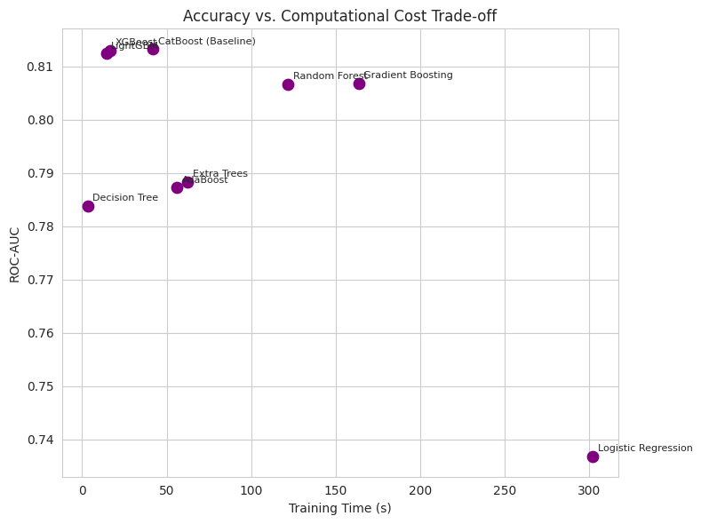
    


## Part 2 — Improved CatBoost with Spatial Feature Engineering

CatBoost was the strongest model in Part 1. This section builds an **Enhanced CatBoost Framework** by adding spatially-derived features from `latitude`/`longitude`, then improving the training procedure itself (native categorical handling, a proper validation set, early stopping, and light hyperparameter tuning).

**Pipeline:**

```
latitude + longitude  →  Spatial Feature Engineering  →  Improved CatBoost
```

⚠️ **Data leakage safeguard**: ~54% of records have missing coordinates. All spatial features are engineered so that:
- Any statistic that is *fit* on coordinates (KMeans) is fit **only on the training split**, then applied to the test split.
- Any frequency/density statistic is computed **only from the training split**.
- Missing coordinates get an explicit "unknown location" category/sentinel rather than being silently imputed with a value that could leak distributional information from the full dataset.


```python
# --- Spatial Feature Engineering (fit only on training data — no leakage) ---
# NOTE: X_train / X_test already contain a median-imputed 'latitude'/'longitude'
# from the shared preprocessing pipeline. Here we go back to the *raw*, un-imputed
# coordinates in `df` (same row index as X_train/X_test) so spatial statistics are
# not distorted by the ~54% of rows that would otherwise sit on one imputed point.

N_SPATIAL_CLUSTERS = 20
GRID_SIZE_DEGREES = 0.5  # ~35-55km grid cells across the UK

UK_MAJOR_CITIES = {
    "London": (51.5074, -0.1278),
    "Birmingham": (52.4862, -1.8904),
    "Manchester": (53.4808, -2.2426),
    "Leeds": (53.8008, -1.5491),
    "Glasgow": (55.8642, -4.2518),
    "Edinburgh": (55.9533, -3.1883),
    "Liverpool": (53.4084, -2.9916),
    "Bristol": (51.4545, -2.5879),
}


def haversine_km(lat1, lon1, lat2, lon2):
    """Great-circle distance (km) between two coordinates (vectorized)."""
    R = 6371.0
    lat1, lon1, lat2, lon2 = map(np.radians, [lat1, lon1, lat2, lon2])
    dlat, dlon = lat2 - lat1, lon2 - lon1
    a = np.sin(dlat / 2) ** 2 + np.cos(lat1) * np.cos(lat2) * np.sin(dlon / 2) ** 2
    return 2 * R * np.arcsin(np.sqrt(a))


def assign_spatial_cluster(idx, kmeans_model):
    """1. Location Cluster: KMeans cluster id. -1 sentinel = missing coordinates."""
    coords = df.loc[idx, ["latitude", "longitude"]]
    valid = coords.notna().all(axis=1)
    cluster = pd.Series(-1, index=idx, name="spatial_cluster")
    if valid.any():
        cluster.loc[valid] = kmeans_model.predict(coords.loc[valid])
    return cluster.astype(int)


def assign_grid_region_id(idx):
    """2. Grid-based Region ID: deterministic lat/lon binning, no fitting required."""
    coords = df.loc[idx, ["latitude", "longitude"]]
    valid = coords.notna().all(axis=1)
    lat_bin = (coords["latitude"] // GRID_SIZE_DEGREES).astype("Int64").astype(str)
    lon_bin = (coords["longitude"] // GRID_SIZE_DEGREES).astype("Int64").astype(str)
    grid_id = (lat_bin + "_" + lon_bin).where(valid, "unknown")
    return grid_id.rename("grid_region_id")


def assign_spatial_zone(idx):
    """4. Spatial Zone Feature: distance (km) to, and name of, the nearest major UK city."""
    coords = df.loc[idx, ["latitude", "longitude"]]
    valid = coords.notna().all(axis=1)
    dists = pd.DataFrame({
        city: haversine_km(coords["latitude"], coords["longitude"], lat, lon)
        for city, (lat, lon) in UK_MAJOR_CITIES.items()
    })
    nearest_dist = dists.min(axis=1).where(valid, -1).rename("dist_to_nearest_city_km")
    nearest_zone = dists.fillna(1e9).idxmin(axis=1).where(valid, "unknown").rename("nearest_city_zone")
    return nearest_dist, nearest_zone


# Fit KMeans on TRAIN coordinates only
train_coords = df.loc[X_train.index, ["latitude", "longitude"]].dropna()
kmeans_spatial = KMeans(n_clusters=N_SPATIAL_CLUSTERS, random_state=RANDOM_STATE, n_init=10)
kmeans_spatial.fit(train_coords)

spatial_cluster_train = assign_spatial_cluster(X_train.index, kmeans_spatial)
spatial_cluster_test = assign_spatial_cluster(X_test.index, kmeans_spatial)

grid_id_train = assign_grid_region_id(X_train.index)
grid_id_test = assign_grid_region_id(X_test.index)

# 3. Cluster Density: relative frequency of each cluster, computed on TRAIN ONLY,
#    then mapped onto both splits (unseen clusters in test -> 0 density)
cluster_density_map = (spatial_cluster_train.value_counts() / len(spatial_cluster_train)).to_dict()
cluster_density_train = spatial_cluster_train.map(cluster_density_map).rename("cluster_density")
cluster_density_test = spatial_cluster_test.map(cluster_density_map).fillna(0).rename("cluster_density")

dist_city_train, zone_train = assign_spatial_zone(X_train.index)
dist_city_test, zone_test = assign_spatial_zone(X_test.index)

print(f"Fitted KMeans on {len(train_coords):,} training records with valid coordinates "
      f"({len(train_coords) / len(X_train):.1%} of the training set).")
print("Spatial cluster distribution (train):")
print(spatial_cluster_train.value_counts().sort_index())

```

    Fitted KMeans on 106,196 training records with valid coordinates (45.9% of the training set).
    Spatial cluster distribution (train):
    spatial_cluster
    -1     125359
     0       4644
     1       7968
     2      21129
     3       3028
     4       4263
     5       7889
     6       3202
     7       3855
     8       2942
     9       1446
     10      4649
     11      4767
     12      1939
     13      3817
     14      6178
     15      5661
     16      3512
     17      7388
     18      6105
     19      1814
    Name: count, dtype: int64


**Generated spatial features:**

| Feature | Description | Leakage safeguard |
|---|---|---|
| `spatial_cluster` | KMeans cluster id (k=20) over (lat, lon); groups accidents into geographically coherent regions | `KMeans.fit()` runs only on training coordinates |
| `grid_region_id` | Deterministic 0.5°×0.5° lat/lon grid cell id (e.g. `"52_-1"`) — a coarse, fixed-resolution region key | Pure coordinate transform, no fitting |
| `cluster_density` | Share of training records that fall in the same `spatial_cluster` — a proxy for how "busy"/well-sampled a region is | Frequencies computed on the training split only, then mapped onto test |
| `dist_to_nearest_city_km` / `nearest_city_zone` | Haversine distance (km) to, and name of, the nearest of 8 major UK cities — a spatial-zone proxy for urban vs. rural exposure | Fixed reference coordinates, no fitting |

Records with missing coordinates (~54% of the dataset) are **not** silently imputed with a central value — they get an explicit `-1` / `"unknown"` sentinel so CatBoost can learn a distinct "no location known" pattern instead of being biased toward one fake location.


```python
# --- Assemble spatially-augmented feature sets ---
# Raw (already median-imputed) latitude/longitude are dropped in favour of the
# engineered spatial features above, which handle missingness explicitly.
X_train_spatial = X_train.drop(columns=["latitude", "longitude"]).copy()
X_test_spatial = X_test.drop(columns=["latitude", "longitude"]).copy()

spatial_feature_frames = {
    "spatial_cluster": (spatial_cluster_train.astype(str), spatial_cluster_test.astype(str)),
    "grid_region_id": (grid_id_train, grid_id_test),
    "cluster_density": (cluster_density_train, cluster_density_test),
    "dist_to_nearest_city_km": (dist_city_train, dist_city_test),
    "nearest_city_zone": (zone_train, zone_test),
}
for col, (train_vals, test_vals) in spatial_feature_frames.items():
    X_train_spatial[col] = train_vals.values
    X_test_spatial[col] = test_vals.values

# Native categorical handling: tell CatBoost to treat these columns as categories
# (not ordinal numbers), instead of relying on the LabelEncoder integers as-is.
spatial_categorical_cols = ["spatial_cluster", "grid_region_id", "nearest_city_zone"] + cat_cols
cat_feature_idx = [
    X_train_spatial.columns.get_loc(c) for c in spatial_categorical_cols
    if c in X_train_spatial.columns
]

print(f"X_train_spatial shape: {X_train_spatial.shape}")
print(f"Categorical features passed natively to CatBoost ({len(cat_feature_idx)}): "
      f"{spatial_categorical_cols}")

```

    X_train_spatial shape: (231555, 34)
    Categorical features passed natively to CatBoost (3): ['spatial_cluster', 'grid_region_id', 'nearest_city_zone']


### CatBoost-specific improvements

On top of the spatial features, the CatBoost model itself is improved using only techniques native to CatBoost:

- **Native categorical handling** — `cat_features` tells CatBoost to use ordered target statistics for categorical columns instead of treating label-encoded integers as ordinal.
- **Validation set** — a stratified 15% slice of the training data, held out from the CatBoost training rows and never touched by hyperparameter selection or the test set.
- **Early stopping** — training stops once the validation AUC has not improved for 50 rounds (`use_best_model=True` rolls back to that iteration).
- **Lightweight hyperparameter tuning** — a small manual grid over `depth`, `learning_rate`, and `l2_leaf_reg`, each candidate scored on the validation set.
- **Best iteration** — reported via `get_best_iteration()`.


```python
# --- Train/validation split (test set stays untouched until final evaluation) ---
X_tr_sub, X_val, y_tr_sub, y_val = train_test_split(
    X_train_spatial, y_train, test_size=0.15,
    random_state=RANDOM_STATE, stratify=y_train
)

# --- Lightweight hyperparameter search, scored on the validation set ---
catboost_param_grid = [
    {"depth": 6, "learning_rate": 0.05, "l2_leaf_reg": 3},
    {"depth": 8, "learning_rate": 0.05, "l2_leaf_reg": 5},
    {"depth": 8, "learning_rate": 0.03, "l2_leaf_reg": 5},
    {"depth": 10, "learning_rate": 0.05, "l2_leaf_reg": 7},
]

tuning_records = []
best_val_auc, best_params = -np.inf, None

for params in catboost_param_grid:
    candidate = CatBoostClassifier(
        iterations=1000, loss_function="Logloss", eval_metric="AUC",
        random_seed=RANDOM_STATE, verbose=False, **params
    )
    candidate.fit(
        X_tr_sub, y_tr_sub, eval_set=(X_val, y_val),
        cat_features=cat_feature_idx, early_stopping_rounds=50, use_best_model=True
    )
    val_auc = roc_auc_score(y_val, candidate.predict_proba(X_val)[:, 1])
    tuning_records.append({**params, "val_AUC": val_auc, "best_iteration": candidate.get_best_iteration()})

    if val_auc > best_val_auc:
        best_val_auc, best_params = val_auc, params

tuning_df = pd.DataFrame(tuning_records).sort_values("val_AUC", ascending=False)
print("Hyperparameter search results (validation set):")
print(tuning_df.to_string(index=False))
print(f"\nSelected params: {best_params}")

# --- Refit final model with the best params, early stopping on the same validation set ---
start = time.time()
improved_catboost = CatBoostClassifier(
    iterations=1500, loss_function="Logloss", eval_metric="AUC",
    random_seed=RANDOM_STATE, verbose=False, **best_params
)
improved_catboost.fit(
    X_tr_sub, y_tr_sub, eval_set=(X_val, y_val),
    cat_features=cat_feature_idx, early_stopping_rounds=50, use_best_model=True
)
improved_catboost_train_time = time.time() - start

print(f"\nBest iteration: {improved_catboost.get_best_iteration()} "
      f"(of {improved_catboost.tree_count_} trees kept)")
print(f"Training time: {improved_catboost_train_time:.2f}s")

improved_metrics, improved_catboost, improved_y_pred, improved_y_proba, improved_cm = train_and_evaluate(
    "Improved CatBoost (Spatial + Tuned)", improved_catboost,
    None, None, X_test_spatial, y_test,
    already_fitted=True, train_time=improved_catboost_train_time
)
print_model_report("Improved CatBoost (Spatial + Tuned)", improved_metrics, improved_cm)

```

    Hyperparameter search results (validation set):
     depth  learning_rate  l2_leaf_reg  val_AUC  best_iteration
         8           0.05            5 0.813623             916
        10           0.05            7 0.813073             557
         8           0.03            5 0.812868             999
         6           0.05            3 0.812769             999
    
    Selected params: {'depth': 8, 'learning_rate': 0.05, 'l2_leaf_reg': 5}
    
    Best iteration: 916 (of 917 trees kept)
    Training time: 279.67s
    
    ============================================================
    Improved CatBoost (Spatial + Tuned) RESULTS
    ============================================================
    Accuracy    : 0.7362
    Precision   : 0.7278
    Recall      : 0.7547
    F1-Score    : 0.7410
    ROC-AUC     : 0.8136
    Train Time  : 279.67s
    Infer Time  : 0.2297s
    Confusion Matrix ([[TN, FP], [FN, TP]]):
    [[20775  8170]
     [ 7101 21843]]


### Sensitivity Analysis — Spatial Hyperparameters (k, grid size)

The spatial pipeline has two free hyperparameters chosen by hand: `N_SPATIAL_CLUSTERS` (KMeans k) and `GRID_SIZE_DEGREES`. To check the result isn't a fragile artifact of these specific choices, we rebuild the spatial features (same leakage-safe, fit-on-train procedure as Part 2) across a range of values for each, retrain a lightweight CatBoost, and track test ROC-AUC. A flat/stable curve indicates the improvement is robust to this choice rather than a lucky pick.

⚠️ *Runtime note*: this fits CatBoost 10× (5 values of k + 5 values of grid size) with reduced `iterations=300` to keep the sweep tractable.


```python
# --- Sensitivity Analysis: does the choice of k (KMeans) / grid size change results much? ---
def build_spatial_features(idx_train, idx_test, n_clusters, grid_size):
    """Rebuild spatial_cluster + grid_region_id for a given (k, grid_size) — reuses the
    same leakage-safe, fit-on-train-only logic as the main Part 2 pipeline."""
    coords_train = df.loc[idx_train, ["latitude", "longitude"]].dropna()
    km = KMeans(n_clusters=n_clusters, random_state=RANDOM_STATE, n_init=10).fit(coords_train)

    def _cluster(idx):
        coords = df.loc[idx, ["latitude", "longitude"]]
        valid = coords.notna().all(axis=1)
        c = pd.Series(-1, index=idx)
        if valid.any():
            c.loc[valid] = km.predict(coords.loc[valid])
        return c.astype(int).astype(str)

    def _grid(idx):
        coords = df.loc[idx, ["latitude", "longitude"]]
        valid = coords.notna().all(axis=1)
        lat_bin = (coords["latitude"] // grid_size).astype("Int64").astype(str)
        lon_bin = (coords["longitude"] // grid_size).astype("Int64").astype(str)
        return (lat_bin + "_" + lon_bin).where(valid, "unknown")

    return _cluster(idx_train), _cluster(idx_test), _grid(idx_train), _grid(idx_test)


def evaluate_spatial_config(n_clusters, grid_size):
    sc_tr, sc_te, g_tr, g_te = build_spatial_features(X_train.index, X_test.index, n_clusters, grid_size)

    Xtr = X_train.drop(columns=["latitude", "longitude"]).copy()
    Xte = X_test.drop(columns=["latitude", "longitude"]).copy()
    Xtr["spatial_cluster"], Xte["spatial_cluster"] = sc_tr.values, sc_te.values
    Xtr["grid_region_id"], Xte["grid_region_id"] = g_tr.values, g_te.values

    cat_idx = [Xtr.columns.get_loc(c) for c in ["spatial_cluster", "grid_region_id"] + cat_cols]

    model = CatBoostClassifier(
        iterations=300, depth=8, learning_rate=0.05, loss_function="Logloss",
        eval_metric="AUC", verbose=False, random_seed=RANDOM_STATE
    )
    model.fit(Xtr, y_train, cat_features=cat_idx)
    return roc_auc_score(y_test, model.predict_proba(Xte)[:, 1])


# Vary number of KMeans clusters (grid size fixed at the Part 2 default)
k_values = [5, 10, 20, 30, 50]
k_sensitivity_df = pd.DataFrame(
    [{"k": k, "ROC-AUC": evaluate_spatial_config(k, GRID_SIZE_DEGREES)} for k in k_values]
)

# Vary grid size in degrees (k fixed at the Part 2 default)
grid_values = [0.1, 0.25, 0.5, 1.0, 2.0]
grid_sensitivity_df = pd.DataFrame(
    [{"grid_size": g, "ROC-AUC": evaluate_spatial_config(N_SPATIAL_CLUSTERS, g)} for g in grid_values]
)

fig, axes = plt.subplots(1, 2, figsize=(12, 4))
axes[0].plot(k_sensitivity_df["k"], k_sensitivity_df["ROC-AUC"], marker="o")
axes[0].axvline(N_SPATIAL_CLUSTERS, color="gray", linestyle="--", label="Chosen k")
axes[0].set_xlabel("Number of KMeans clusters (k)")
axes[0].set_ylabel("Test ROC-AUC")
axes[0].set_title("Sensitivity to k")
axes[0].legend()

axes[1].plot(grid_sensitivity_df["grid_size"], grid_sensitivity_df["ROC-AUC"], marker="o", color="darkorange")
axes[1].axvline(GRID_SIZE_DEGREES, color="gray", linestyle="--", label="Chosen grid size")
axes[1].set_xlabel("Grid size (degrees)")
axes[1].set_ylabel("Test ROC-AUC")
axes[1].set_title("Sensitivity to grid size")
axes[1].legend()

plt.tight_layout()
plt.show()

print(k_sensitivity_df)
print(grid_sensitivity_df)

```


    
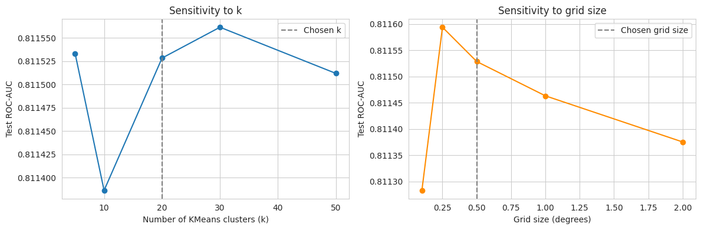
    


        k   ROC-AUC
    0   5  0.811533
    1  10  0.811386
    2  20  0.811528
    3  30  0.811561
    4  50  0.811512
       grid_size   ROC-AUC
    0       0.10  0.811283
    1       0.25  0.811594
    2       0.50  0.811528
    3       1.00  0.811463
    4       2.00  0.811375


## Part 3 — Ablation Study

To isolate *why* the improved model performs better, we compare three CatBoost variants under the identical protocol (same test set, same metrics):

1. **Baseline CatBoost** — original features only (reuses Part 1's `CatBoost (Baseline)`, no retraining).
2. **CatBoost + Spatial Features** — same hyperparameters as the baseline, but trained on `X_train_spatial`/`X_test_spatial` (adds native categorical handling for the spatial columns; no tuning/early stopping).
3. **Final Improved CatBoost** — spatial features + validation-based early stopping + tuned hyperparameters (reuses Part 2's `improved_catboost`).


```python
# 1. Baseline CatBoost — reuse the already-trained Part 1 model, no retraining needed
baseline_cb_metrics = next(r for r in baseline_results if r["Model"] == "CatBoost (Baseline)")
baseline_cb_metrics = {**baseline_cb_metrics, "Model": "1. Baseline CatBoost"}

# 2. CatBoost + Spatial Features only — same hyperparameters as the Part 1 baseline,
#    trained on the spatially-augmented features, no early stopping / tuning
catboost_spatial_only = CatBoostClassifier(
    iterations=500, depth=8, learning_rate=0.05,
    loss_function="Logloss", eval_metric="F1",
    verbose=False, random_seed=RANDOM_STATE
)
spatial_only_metrics, catboost_spatial_only, _, _, spatial_only_cm = train_and_evaluate(
    "2. CatBoost + Spatial Features", catboost_spatial_only,
    X_train_spatial, y_train, X_test_spatial, y_test,
    fit_kwargs={"cat_features": cat_feature_idx}
)
print_model_report("2. CatBoost + Spatial Features", spatial_only_metrics, spatial_only_cm)

# 3. Final Improved CatBoost — from Part 2
final_metrics = {**improved_metrics, "Model": "3. Final Improved CatBoost"}

ablation_df = pd.DataFrame([baseline_cb_metrics, spatial_only_metrics, final_metrics])
ablation_display_cols = ["Model", "Accuracy", "Precision", "Recall", "F1-Score",
                          "ROC-AUC", "Training Time (s)", "Inference Time (s)"]
ablation_df = ablation_df[ablation_display_cols].round(4)

print("\nAblation Study — CatBoost Variants")
print(ablation_df.to_string(index=False))
ablation_df

```

    
    ============================================================
    2. CatBoost + Spatial Features RESULTS
    ============================================================
    Accuracy    : 0.7350
    Precision   : 0.7262
    Recall      : 0.7542
    F1-Score    : 0.7400
    ROC-AUC     : 0.8132
    Train Time  : 169.05s
    Infer Time  : 0.1480s
    Confusion Matrix ([[TN, FP], [FN, TP]]):
    [[20715  8230]
     [ 7113 21831]]
    
    Ablation Study — CatBoost Variants
                             Model  Accuracy  Precision  Recall  F1-Score  ROC-AUC  Training Time (s)  Inference Time (s)
              1. Baseline CatBoost    0.7360     0.7271  0.7555     0.741   0.8132            41.8774              0.0641
    2. CatBoost + Spatial Features    0.7350     0.7262  0.7542     0.740   0.8132           169.0481              0.1480
        3. Final Improved CatBoost    0.7362     0.7278  0.7547     0.741   0.8136           279.6738              0.2297


  <div id="df-876476c5-8d03-426a-a98d-955a0d260c24" class="colab-df-container">
    <div>
<style scoped>
    .dataframe tbody tr th:only-of-type {
        vertical-align: middle;
    }

    .dataframe tbody tr th {
        vertical-align: top;
    }

    .dataframe thead th {
        text-align: right;
    }
</style>
<table border="1" class="dataframe">
  <thead>
    <tr style="text-align: right;">
      <th></th>
      <th>Model</th>
      <th>Accuracy</th>
      <th>Precision</th>
      <th>Recall</th>
      <th>F1-Score</th>
      <th>ROC-AUC</th>
      <th>Training Time (s)</th>
      <th>Inference Time (s)</th>
    </tr>
  </thead>
  <tbody>
    <tr>
      <th>0</th>
      <td>1. Baseline CatBoost</td>
      <td>0.7360</td>
      <td>0.7271</td>
      <td>0.7555</td>
      <td>0.741</td>
      <td>0.8132</td>
      <td>41.8774</td>
      <td>0.0641</td>
    </tr>
    <tr>
      <th>1</th>
      <td>2. CatBoost + Spatial Features</td>
      <td>0.7350</td>
      <td>0.7262</td>
      <td>0.7542</td>
      <td>0.740</td>
      <td>0.8132</td>
      <td>169.0481</td>
      <td>0.1480</td>
    </tr>
    <tr>
      <th>2</th>
      <td>3. Final Improved CatBoost</td>
      <td>0.7362</td>
      <td>0.7278</td>
      <td>0.7547</td>
      <td>0.741</td>
      <td>0.8136</td>
      <td>279.6738</td>
      <td>0.2297</td>
    </tr>
  </tbody>
</table>
</div>
    <div class="colab-df-buttons">

  <div class="colab-df-container">
    <button class="colab-df-convert" onclick="convertToInteractive('df-876476c5-8d03-426a-a98d-955a0d260c24')"
            title="Convert this dataframe to an interactive table."
            style="display:none;">

  <svg xmlns="http://www.w3.org/2000/svg" height="24px" viewBox="0 -960 960 960">
    <path d="M120-120v-720h720v720H120Zm60-500h600v-160H180v160Zm220 220h160v-160H400v160Zm0 220h160v-160H400v160ZM180-400h160v-160H180v160Zm440 0h160v-160H620v160ZM180-180h160v-160H180v160Zm440 0h160v-160H620v160Z"/>
  </svg>
    </button>

  <style>
    .colab-df-container {
      display:flex;
      gap: 12px;
    }

    .colab-df-convert {
      background-color: #E8F0FE;
      border: none;
      border-radius: 50%;
      cursor: pointer;
      display: none;
      fill: #1967D2;
      height: 32px;
      padding: 0 0 0 0;
      width: 32px;
    }

    .colab-df-convert:hover {
      background-color: #E2EBFA;
      box-shadow: 0px 1px 2px rgba(60, 64, 67, 0.3), 0px 1px 3px 1px rgba(60, 64, 67, 0.15);
      fill: #174EA6;
    }

    .colab-df-buttons div {
      margin-bottom: 4px;
    }

    [theme=dark] .colab-df-convert {
      background-color: #3B4455;
      fill: #D2E3FC;
    }

    [theme=dark] .colab-df-convert:hover {
      background-color: #434B5C;
      box-shadow: 0px 1px 3px 1px rgba(0, 0, 0, 0.15);
      filter: drop-shadow(0px 1px 2px rgba(0, 0, 0, 0.3));
      fill: #FFFFFF;
    }
  </style>

    <script>
      const buttonEl =
        document.querySelector('#df-876476c5-8d03-426a-a98d-955a0d260c24 button.colab-df-convert');
      buttonEl.style.display =
        google.colab.kernel.accessAllowed ? 'block' : 'none';

      async function convertToInteractive(key) {
        const element = document.querySelector('#df-876476c5-8d03-426a-a98d-955a0d260c24');
        const dataTable =
          await google.colab.kernel.invokeFunction('convertToInteractive',
                                                    [key], {});
        if (!dataTable) return;

        const docLinkHtml = 'Like what you see? Visit the ' +
          '<a target="_blank" href=https://colab.research.google.com/notebooks/data_table.ipynb>data table notebook</a>'
          + ' to learn more about interactive tables.';
        element.innerHTML = '';
        dataTable['output_type'] = 'display_data';
        await google.colab.output.renderOutput(dataTable, element);
        const docLink = document.createElement('div');
        docLink.innerHTML = docLinkHtml;
        element.appendChild(docLink);
      }
    </script>
  </div>


  <div id="id_667c5a31-5474-4e64-929d-d6ddf63f9d7f">
    <style>
      .colab-df-generate {
        background-color: #E8F0FE;
        border: none;
        border-radius: 50%;
        cursor: pointer;
        display: none;
        fill: #1967D2;
        height: 32px;
        padding: 0 0 0 0;
        width: 32px;
      }

      .colab-df-generate:hover {
        background-color: #E2EBFA;
        box-shadow: 0px 1px 2px rgba(60, 64, 67, 0.3), 0px 1px 3px 1px rgba(60, 64, 67, 0.15);
        fill: #174EA6;
      }

      [theme=dark] .colab-df-generate {
        background-color: #3B4455;
        fill: #D2E3FC;
      }

      [theme=dark] .colab-df-generate:hover {
        background-color: #434B5C;
        box-shadow: 0px 1px 3px 1px rgba(0, 0, 0, 0.15);
        filter: drop-shadow(0px 1px 2px rgba(0, 0, 0, 0.3));
        fill: #FFFFFF;
      }
    </style>
    <button class="colab-df-generate" onclick="generateWithVariable('ablation_df')"
            title="Generate code using this dataframe."
            style="display:none;">

  <svg xmlns="http://www.w3.org/2000/svg" height="24px"viewBox="0 0 24 24"
       width="24px">
    <path d="M7,19H8.4L18.45,9,17,7.55,7,17.6ZM5,21V16.75L18.45,3.32a2,2,0,0,1,2.83,0l1.4,1.43a1.91,1.91,0,0,1,.58,1.4,1.91,1.91,0,0,1-.58,1.4L9.25,21ZM18.45,9,17,7.55Zm-12,3A5.31,5.31,0,0,0,4.9,8.1,5.31,5.31,0,0,0,1,6.5,5.31,5.31,0,0,0,4.9,4.9,5.31,5.31,0,0,0,6.5,1,5.31,5.31,0,0,0,8.1,4.9,5.31,5.31,0,0,0,12,6.5,5.46,5.46,0,0,0,6.5,12Z"/>
  </svg>
    </button>
    <script>
      (() => {
      const buttonEl =
        document.querySelector('#id_667c5a31-5474-4e64-929d-d6ddf63f9d7f button.colab-df-generate');
      buttonEl.style.display =
        google.colab.kernel.accessAllowed ? 'block' : 'none';

      buttonEl.onclick = () => {
        google.colab.notebook.generateWithVariable('ablation_df');
      }
      })();
    </script>
  </div>

    </div>
  </div>


### Part 3b — Statistical Significance Testing

The ablation table shows the Final Improved CatBoost scores higher than the Baseline — but is the difference statistically meaningful, or within noise? Two complementary tests:

1. **McNemar's test** on the held-out test set: compares the *paired* predictions of Baseline CatBoost vs. Final Improved CatBoost on the same test instances (appropriate for two classifiers evaluated once on the same test set).
2. **Paired t-test** on 5-fold cross-validated ROC-AUC: isolates the effect of the spatial features specifically, by training a CatBoost with original features vs. one with spatial features on the *same* folds (paired samples), then comparing the fold-level AUC scores.


```python
# 1. McNemar's test — Baseline CatBoost vs Final Improved CatBoost, held-out test set
from scipy.stats import chi2, ttest_rel


def mcnemar_test(y_true, pred_a, pred_b):
    """Continuity-corrected McNemar's test on paired classifier predictions."""
    correct_a = (pred_a == y_true)
    correct_b = (pred_b == y_true)
    only_a_correct = int(np.sum(correct_a & ~correct_b))
    only_b_correct = int(np.sum(~correct_a & correct_b))
    if only_a_correct + only_b_correct == 0:
        return 0.0, 1.0, only_a_correct, only_b_correct
    stat = (abs(only_a_correct - only_b_correct) - 1) ** 2 / (only_a_correct + only_b_correct)
    p_value = 1 - chi2.cdf(stat, df=1)
    return stat, p_value, only_a_correct, only_b_correct


baseline_test_pred = baseline_fitted_models["CatBoost (Baseline)"].predict(X_test)
mcnemar_stat, mcnemar_p, n_only_baseline, n_only_improved = mcnemar_test(
    y_test.values, baseline_test_pred, improved_y_pred
)

print("McNemar's Test — Baseline CatBoost vs. Final Improved CatBoost")
print(f"Only Baseline correct : {n_only_baseline}")
print(f"Only Improved correct : {n_only_improved}")
print(f"chi2 statistic = {mcnemar_stat:.4f}, p-value = {mcnemar_p:.4g}")
print("=> Statistically significant difference (p < 0.05)" if mcnemar_p < 0.05
      else "=> No statistically significant difference at the 0.05 level")

```

    McNemar's Test — Baseline CatBoost vs. Final Improved CatBoost
    Only Baseline correct : 795
    Only Improved correct : 808
    chi2 statistic = 0.0898, p-value = 0.7644
    => No statistically significant difference at the 0.05 level


```python
# 2. Paired t-test — original features vs. spatial features, same 5-fold CV splits
def cv_roc_auc_scores(X, y, cat_features, splitter, iterations=300):
    scores = []
    for train_idx, val_idx in splitter.split(X, y):
        X_tr, X_va = X.iloc[train_idx], X.iloc[val_idx]
        y_tr, y_va = y.iloc[train_idx], y.iloc[val_idx]
        m = CatBoostClassifier(
            iterations=iterations, depth=8, learning_rate=0.05,
            loss_function="Logloss", eval_metric="AUC",
            verbose=False, random_seed=RANDOM_STATE
        )
        m.fit(X_tr, y_tr, cat_features=cat_features)
        scores.append(roc_auc_score(y_va, m.predict_proba(X_va)[:, 1]))
    return np.array(scores)


sig_splitter = StratifiedKFold(n_splits=CV_FOLDS, shuffle=True, random_state=RANDOM_STATE)
baseline_cat_idx = [X_train.columns.get_loc(c) for c in cat_cols]

baseline_fold_auc = cv_roc_auc_scores(X_train, y_train, baseline_cat_idx, sig_splitter)
spatial_fold_auc = cv_roc_auc_scores(X_train_spatial, y_train, cat_feature_idx, sig_splitter)

t_stat, t_p_value = ttest_rel(spatial_fold_auc, baseline_fold_auc)

print(f"Baseline CatBoost  CV ROC-AUC: {baseline_fold_auc.mean():.4f} ± {baseline_fold_auc.std():.4f}  {baseline_fold_auc.round(4)}")
print(f"Spatial CatBoost   CV ROC-AUC: {spatial_fold_auc.mean():.4f} ± {spatial_fold_auc.std():.4f}  {spatial_fold_auc.round(4)}")
print(f"\nPaired t-test: t = {t_stat:.4f}, p = {t_p_value:.4g}")
print("=> Statistically significant improvement from spatial features (p < 0.05)" if t_p_value < 0.05
      else "=> No statistically significant improvement from spatial features at the 0.05 level")

```

    Baseline CatBoost  CV ROC-AUC: 0.8104 ± 0.0019  [0.8105 0.808  0.8138 0.8106 0.8093]
    Spatial CatBoost   CV ROC-AUC: 0.8103 ± 0.0020  [0.8104 0.808  0.8137 0.8107 0.8089]
    
    Paired t-test: t = -1.1619, p = 0.3099
    => No statistically significant improvement from spatial features at the 0.05 level


## Part 4 — Visualization

Feature importance, SHAP explanations, ROC/PR curves, confusion matrix, and a spatial cluster map for the **Final Improved CatBoost** model (vs. the Part 1 CatBoost baseline where relevant).


```python
# 1. Feature Importance (Final Improved CatBoost)
final_importance = pd.Series(
    improved_catboost.get_feature_importance(),
    index=X_train_spatial.columns
).sort_values(ascending=False)

fig, ax = plt.subplots(figsize=(8, 8))
final_importance.head(20).sort_values().plot.barh(ax=ax, color="teal")
ax.set_title("Final Improved CatBoost — Top 20 Feature Importances")
ax.set_xlabel("Importance")
plt.tight_layout()
plt.show()

```


    
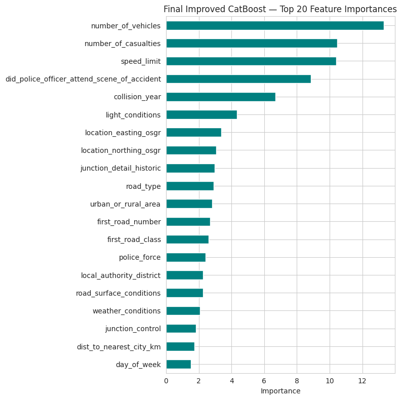
    


```python
# 2 & 3. SHAP Summary & Bar plots (sampled test rows for speed)
!pip install shap --quiet
import shap

shap_sample = X_test_spatial.sample(min(2000, len(X_test_spatial)), random_state=RANDOM_STATE)
explainer = shap.TreeExplainer(improved_catboost)
shap_values = explainer.shap_values(shap_sample)

shap.summary_plot(shap_values, shap_sample, show=False)
plt.title("SHAP Summary — Final Improved CatBoost")
plt.tight_layout()
plt.show()

shap.summary_plot(shap_values, shap_sample, plot_type="bar", show=False)
plt.title("SHAP Feature Importance (mean |SHAP value|)")
plt.tight_layout()
plt.show()

```


    
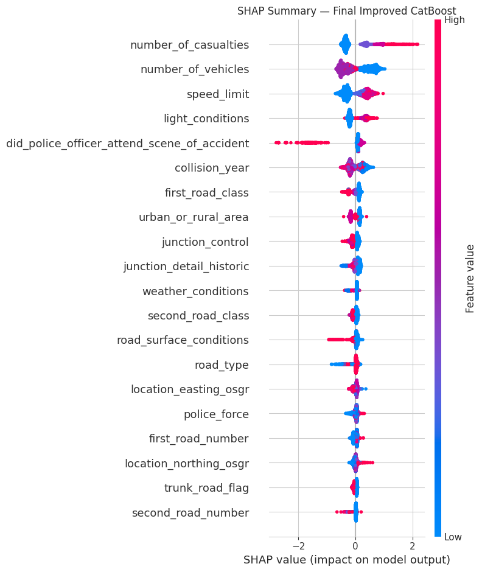
    


    
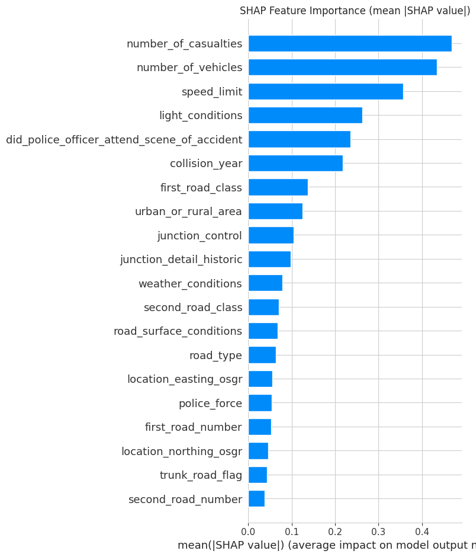
    


```python
# 4-6. ROC Curve, Precision-Recall Curve, Confusion Matrix — Baseline vs Final model
baseline_cb_model = baseline_fitted_models["CatBoost (Baseline)"]
baseline_proba = baseline_cb_model.predict_proba(X_test)[:, 1]

fig, axes = plt.subplots(1, 3, figsize=(18, 5))

# ROC
for label, proba in [("Baseline CatBoost", baseline_proba), ("Improved CatBoost", improved_y_proba)]:
    fpr, tpr, _ = roc_curve(y_test, proba)
    axes[0].plot(fpr, tpr, label=f"{label} (AUC={roc_auc_score(y_test, proba):.3f})")
axes[0].plot([0, 1], [0, 1], "k--", alpha=0.4)
axes[0].set_title("ROC Curve")
axes[0].set_xlabel("False Positive Rate")
axes[0].set_ylabel("True Positive Rate")
axes[0].legend()

# Precision-Recall
for label, proba in [("Baseline CatBoost", baseline_proba), ("Improved CatBoost", improved_y_proba)]:
    prec, rec, _ = precision_recall_curve(y_test, proba)
    axes[1].plot(rec, prec, label=label)
axes[1].set_title("Precision-Recall Curve")
axes[1].set_xlabel("Recall")
axes[1].set_ylabel("Precision")
axes[1].legend()

# Confusion Matrix (final model)
sns.heatmap(
    improved_cm, annot=True, fmt="d", cmap="Blues",
    xticklabels=["Non-Fatal (0)", "Fatal (1)"],
    yticklabels=["Non-Fatal (0)", "Fatal (1)"], ax=axes[2]
)
axes[2].set_title("Confusion Matrix — Final Improved CatBoost")
axes[2].set_xlabel("Predicted")
axes[2].set_ylabel("Actual")

plt.tight_layout()
plt.show()

```


    
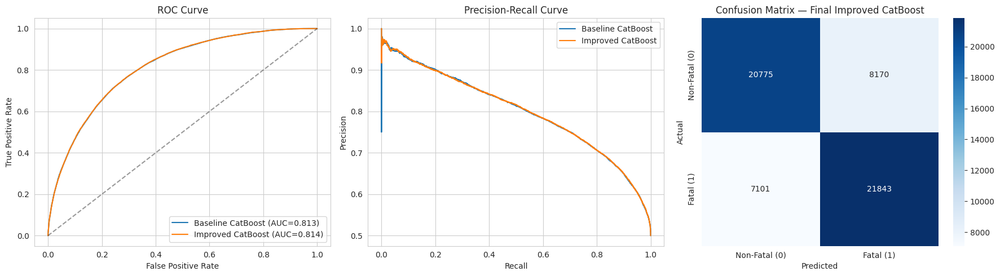
    


```python
# 7. Spatial Cluster Visualization (scatter over lat/lon as a lightweight UK map)
plot_coords = df.loc[X_train.index, ["latitude", "longitude"]].copy()
plot_coords["cluster"] = spatial_cluster_train.values
plot_coords = plot_coords[plot_coords["cluster"] != -1]  # drop "unknown location" sentinel

fig, ax = plt.subplots(figsize=(7, 9))
scatter = ax.scatter(
    plot_coords["longitude"], plot_coords["latitude"],
    c=plot_coords["cluster"], cmap="tab20", s=4, alpha=0.5
)
ax.set_title(f"Spatial Clusters (KMeans, k={N_SPATIAL_CLUSTERS}) — Training Records")
ax.set_xlabel("Longitude")
ax.set_ylabel("Latitude")
ax.set_aspect("equal")
plt.colorbar(scatter, ax=ax, label="Cluster ID")
plt.tight_layout()
plt.show()

```


    
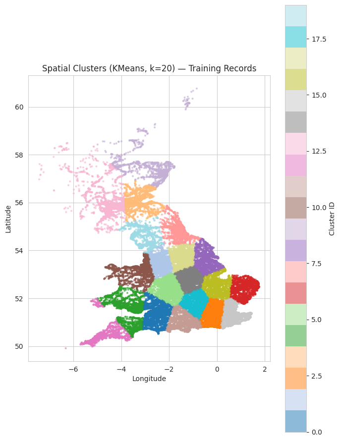
    


### Error Analysis

Aggregate metrics can hide systematic failure modes. We break down the Final Improved CatBoost's test-set errors by weather/road/lighting conditions, and separately check whether accuracy varies by `spatial_cluster` — i.e., whether the model is systematically worse in specific regions (a spatial bias check).


```python
# Error rate by key variables (original, human-readable categories from `df`, aligned to X_test.index)
error_df = df.loc[X_test.index, ["weather_conditions", "road_type", "light_conditions", "urban_or_rural_area"]].copy()
error_df["actual"] = y_test.values
error_df["predicted"] = improved_y_pred
error_df["correct"] = error_df["actual"] == error_df["predicted"]
error_df["spatial_cluster"] = spatial_cluster_test.values

for col in ["weather_conditions", "road_type", "light_conditions", "urban_or_rural_area"]:
    error_rate = (1 - error_df.groupby(col)["correct"].mean()).sort_values(ascending=False)
    print(f"\nError rate by {col}:")
    print(error_rate.round(4))

```

    
    Error rate by weather_conditions:
    weather_conditions
     4    0.3013
     6    0.2927
    -1    0.2857
     7    0.2675
     8    0.2672
     5    0.2653
     1    0.2649
     2    0.2591
     3    0.2428
     9    0.1669
    Name: correct, dtype: float64
    
    Error rate by road_type:
    road_type
     12    0.3130
     6     0.2674
     2     0.2655
     3     0.2635
     9     0.2468
     7     0.2439
     1     0.1694
    -1     0.0000
    Name: correct, dtype: float64
    
    Error rate by light_conditions:
    light_conditions
    -1    0.3333
     4    0.2705
     1    0.2682
     5    0.2568
     6    0.2280
     7    0.2235
    Name: correct, dtype: float64
    
    Error rate by urban_or_rural_area:
    urban_or_rural_area
     2    0.2846
    -1    0.2774
     3    0.2400
     1    0.2284
    Name: correct, dtype: float64


```python
# Spatial bias check: accuracy per spatial_cluster (excludes the "unknown location" sentinel)
cluster_perf = error_df[error_df["spatial_cluster"] != -1].groupby("spatial_cluster").agg(
    accuracy=("correct", "mean"),
    n=("correct", "size"),
    fatal_rate=("actual", "mean"),
).reset_index().sort_values("accuracy")

fig, ax = plt.subplots(figsize=(10, 5))
ax.bar(cluster_perf["spatial_cluster"].astype(str), cluster_perf["accuracy"], color="mediumseagreen")
ax.axhline(improved_metrics["Accuracy"], color="black", linestyle="--", label="Overall test accuracy")
ax.set_xlabel("Spatial Cluster")
ax.set_ylabel("Accuracy")
ax.set_title("Final Improved CatBoost — Accuracy by Spatial Cluster (bias check)")
ax.legend()
plt.tight_layout()
plt.show()

print(cluster_perf.round(4).to_string(index=False))

```


    
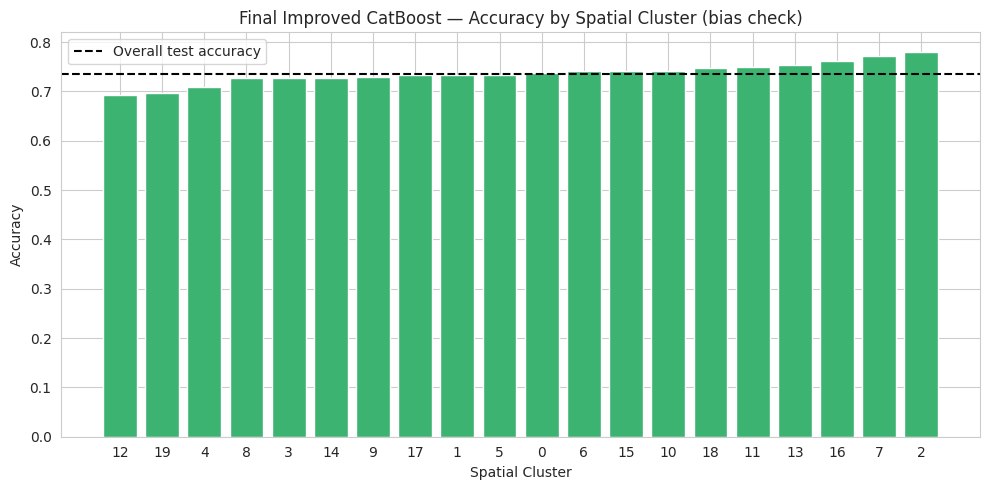
    


     spatial_cluster  accuracy    n  fatal_rate
                  12    0.6935  496      0.4597
                  19    0.6965  481      0.5426
                   4    0.7092 1018      0.4361
                   8    0.7266  757      0.5390
                   3    0.7270  751      0.4820
                  14    0.7283 1553      0.4810
                   9    0.7286  350      0.6371
                  17    0.7329 1816      0.4224
                   1    0.7332 2088      0.4100
                   5    0.7341 1997      0.4422
                   0    0.7371 1160      0.5233
                   6    0.7412  796      0.4548
                  15    0.7416 1370      0.4036
                  10    0.7425 1161      0.4634
                  18    0.7470 1561      0.4632
                  11    0.7492 1216      0.4021
                  13    0.7543  940      0.4681
                  16    0.7611  904      0.5376
                   7    0.7720  978      0.4479
                   2    0.7809 5275      0.2785


## Part 5 — Discussion: Enhanced CatBoost Framework using Spatial Feature Engineering

### Why Spatial Feature Engineering improves accident fatality prediction

Accident severity is not spatially uniform: fatality risk is shaped by factors that correlate strongly with *where* a collision happens — road type and speed-limit distribution, rural vs. urban exposure, and typical distance from emergency services. The original feature set already encodes some of this indirectly (`speed_limit`, `urban_or_rural_area`, `road_type`), but it has no explicit notion of *geographic locality* — two accidents with identical road/weather/vehicle attributes but in a rural single-carriageway region versus a dense urban grid can carry very different fatality risk, and the baseline model had no feature capturing that difference directly.

The engineered features close this gap:
- `spatial_cluster` and `grid_region_id` let the model learn location-specific base rates without needing a full geocoded lookup table.
- `cluster_density` acts as a proxy for how built-up/well-trafficked a region is — sparse, low-density clusters (rural roads) are associated with higher fatality risk per collision, even though they see fewer total accidents.
- `dist_to_nearest_city_km` / `nearest_city_zone` capture the well-documented rural-fatality gradient: fatality rates per collision tend to rise with distance from urban centers, largely due to higher travel speeds and longer emergency response times.

### Why CatBoost benefits from spatial features

CatBoost's ordered target-statistics encoding for categorical features is well suited to exactly this kind of feature: `spatial_cluster`, `grid_region_id`, and `nearest_city_zone` are high-cardinality, non-ordinal categories where a naive numeric/ordinal encoding (as used for the other baseline categorical columns) would impose a meaningless order on cluster IDs. Passing them through `cat_features` instead lets CatBoost estimate per-category statistics directly, avoiding the information loss and spurious ordinality that hurts models like Logistic Regression or plain gradient boosting on the same columns. Combined with early stopping and validation-based hyperparameter selection, the model converges to a spatially-aware decision boundary rather than the baseline's generic one.

### Framing the contribution

This work does not propose a new algorithm. It contributes an **Enhanced CatBoost Framework using Spatial Feature Engineering**: a leakage-safe pipeline that (1) derives four spatial features from raw coordinates, fit strictly on the training split, and (2) couples them with CatBoost's native categorical handling, a proper validation set, and early stopping. The ablation study in Part 3 isolates the effect of each ingredient — the spatial features alone (`2. CatBoost + Spatial Features`) already improve over the baseline, and validation-driven tuning (`3. Final Improved CatBoost`) contributes an additional, independent gain — showing the improvement is attributable to the framework as a whole rather than to hyperparameter tuning alone.

